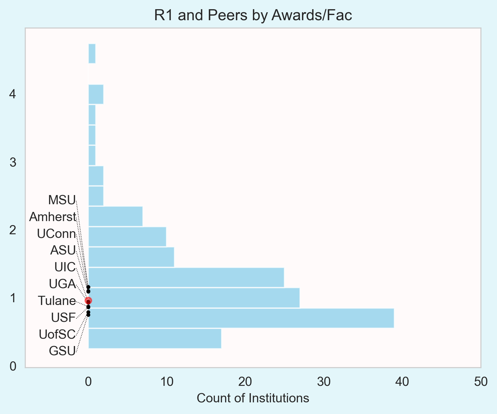

<h1>FSU Vision 2030 Peers Assessment</h1>

## Introduction

This report presents an initial examination of peer assessment utilizing data points of interest from Vision 2030. Our goal is to identify institutions comparable to FSU on high-value metrics. The results are not meant to be conclusive, but to inform further interpretation.

In order to identify institutions comparable to FSU we must first understand how institutions vary. What follows is a multivariate exploratory data analysis of institutional characteristics. Observed patterns are used to inform a peer matching strategy.

The population of institutions is [Carnegie R1 Institutions](https://carnegieclassifications.acenet.edu/carnegie-classification/classification-methodology/basic-classification/) captured in IPEDS. The sample size is 146.

### Data

The primary sources of data are Academic Analytics and the Integrated Postsecondary Education Data System (IPEDS).

There are two broad areas of interest reflected in metrics: per-capita research activity and academic characteristics.

Research activity metrics are per-capita metrics reflecting for instance the number of articles published per faculty count. Academic characteristics include <code>% Pell</code>, <code>Graduation Rate</code>, <code>Pell Graduation Rate</code>, and <code>Pell Graduation Rate Gap</code>.

Further relevant metrics are pulled from IPEDS.

Additional Data Details

All data used in statistical models is first normalized to have mean 0 and standard deviation 1.

Research expenditures metrics are <code>Phase 1 Expenditures</code> and <code>Phase 2 Expenditures</code>. "These metrics, including their per-faculty figures, are initially measured on a scale of thousands. For this analysis we apply a log transform.

Metrics of Primary Interest:

  <ul>
    <li>Articles/Faculty</li>
    <li>Awards/Faculty</li>
    <li>Books/Faculty</li>
    <li>Chapters/Faculty</li>
    <li>Citations/Faculty</li>
    <li>Clinical Trials/Faculty</li>
    <li>Conference Proceedings/Faculty</li>
    <li>Highly-Prestigious Awards/Faculty</li>
    <li>National Academy Members/Faculty</li>
    <li>Patents/Faculty</li>
    <li>Research Doctorates Produced/Faculty</li>
    <li>Professional Doctorates Produced/Faculty</li>
    <li>Total Doctorates Produced/Faculty</li>
    <li>Phase 1 Expenditures/Faculty</li>
    <li>Phase 2 Expenditures/Faculty</li>
    <li>Graduation Rate</li>
    <li>% Pell</li>
    <li>Pell Student Graduation Rate</li>
    <li>Pell Student Graduation Rate Gap</li>
  </ul>

The CUNY Graduate School and University Center's reported value for <code>Research Doctorates/Faculty</code> is excluded as an outlier.

 

The Universities of Mississippi, New Hampshire, Maryland, Oklahoma, Ohio University, and Oregon State University showed original Phase 1 or Phase 2 values at 0. That figure appears inconsistent with the distribution of values of the population and are discarded.

### Methodology and Outline

We first examine the accuracy of [Principal Component Analysis on Primary Metrics](#principal-component-analysis-on-primary-metrics). This section provides an initial view of the correlation structure of institutional research metrics. It is observed that certain metrics appear tightly correlated (<code>Articles/Faculty</code>, <code>Citations/Faculty</code>, and <code>Awards/Faculty</code>) while others lack strong correlations with other metrics.

This is followed by a closer look at the [Correlation Structure](#correlational-eda) of groups of metrics by similarity.

An additional exploratory step looks for [IPEDS Metrics](#correlations-with-ipeds-indicators) showing high correlations with the primary metrics, introducing additional avenues of analysis.

The results of these initial examinations informs peer selection via [PCA Biplots](#peer-selection-via-biplots) and via a [Distance Criterion](#peer-selection-via-nearness). We conclude with a candidate [Selection of Peers](#peer-selection).

## Principal Component Analysis on Primary Metrics

PCA is a dimension reduction technique which produces a representation of data with fewer columns. The reduced representation of data is created by taking weighted averages of initial data columns in a way known to be the optimal linear reduction.

  
PCA Primer

PCA is useful in situations where data is thought to operate in a lower-dimensional space than how it presents.

It will be shown, for instance, that the <code>Books/Faculty</code> and <code>Chapters/Faculty</code> metrics are highly correlated. In a PCA model, those two columns could be represented by a single column which is able to recover the original two columns with high accuracy.

Given initial columns of data, PCA models are applied to estimate a desired number of output columns called the <code>rank</code> of the model. The lowest rank that is able to model the dataset is thought to be the underlying dimensionality of the data. Having a low-rank model also simplifies analysis and can mitigate issues like missingness and noise.

The choice of model rank is a tradeoff between dimension reduction and retained accuracy. PCA is typically applied at varying ranks less than the original dimensionality of the data. The marginal contribution of each additional low-rank dimension is typically viewed in a 
<a href="https://en.wikipedia.org/wiki/Scree_plot">Scree Plot</a>. We will use a modified approach to observe the reconstruction accuracy of the original data columns as $R^2$.

Data which can be reduced to one or two dimensions can then be plotted.

PCA is a multivariate technique, meaning it is used to analyze a dataset in its entirety rather than to predict a single outcome. Further, it is pure calculation. The model does not require any assumptions be made about the underlying data. You can always apply PCA, and whether the result accurately models the data or not, it will always produce the optimal linear combinations for the chosen rank. In particular, PCA is not an inferential model and does not test a hypothesis or produce a p-value. It can be thought of as a summarization technique like a correlation or a median. The other major dimension reduction technique, Factor Analysis, is the appropriate choice for building a theoretical model based on an assumed probability distribution of the data. Thus PCA has a tendency to be applied in areas where the goal is accurate modeling of data versus Factor Analysis being used when trying to develop a theoretical model of the phenomenon underlying the data.

In practice, however, any time PCA is applied, a Factor Analysis style interpretation is inescapable. The lower-dimensional representation of data is intuitively interpreted as latent factors in an implicit theoretical model of the data. Because PCA produces orthogonal components, the model can be thought of as finding the underlying axes along which the data varies. We do not try to avoid these interpretations and, somewhat improperly, call lower-dimension representations "constructs". Ultimately, we do not need principal components to have genuine theoretical meaning, we only need them to be useful representations of covariance structure.

We examine PCA on absolute metrics of research activity followed by per-faculty metrics.

### Absolute Metrics of Research Activity

Model accuracy is observed at varying ranks.

    

To the far right of the chart, models trained with the same rank as the number of initial data columns are able to perfectly represent the dataset because no dimension reduction has actually occurred.

As you move to the left, the dashed black line shows the overall reconstruction accuracy decreasing. The solid lines show the decreasing accuracy of reconstructing each individual metric, which clearly lose accuracy at different rates. The final rank-1 model has converged on retaining accuracy of Articles, Citations, and Awards, which can reproduce those columns at $R^2 > .9$. Those three features dominate the rank-1 model.

Other research metrics are modeled with varying accuracy. The lowest accuracy metrics, <code>Phase 2 Expenditures</code> and <code>Professional Doctorates Awarded</code>, were de-emphasized by the model in order to focus on the better-estimated metrics. This is the nature of dimension reduction. Phase 1 and 2 Expenditures show early and dramatic divergence, suggesting they cannot be modeled as linear combinations of the better-estimated metrics.

 
### Per-Faculty Metrics of Research Activity

    

PCA models trained on per-faculty research metrics show the same trend. There is a relatively convincing cluster of metrics at $R^2>.6$ for rank 1 with the remaining metrics showing sharp decline with decreasing rank.

N.B. the proximity of the bottom metrics' rank-1 terminal points does not suggest any similarity between them, only that they are poorly estimated at that rank.

 
### Research Metrics Biplot

Though a somewhat unconventional approach, PCA can be used to estimate similarity of features directly.

<h4 class="caption-heading">Research Metrics Biplot</h4>

    

 
The tentative interpretation is that <code>Books/Faculty</code> and <code>Chapters/Faculty</code> are only correlated with each other; <code>% Pell</code> and <code>Pell Graduation Rate Gap</code> are only correlated with each other; <code>Graduation Rate</code> and <code>Pell Graduation Rate</code> are strongly correlated; and that most research productivity metrics appear to generally covary with some standout exceptions.

 

## Correlational EDA

With some loose notions of what to look for, we start examining correlations directly.

### Correlation Heatmaps

A correlation heatmap is a representation of a correlation matrix with correlation intensity shown by a color. In this case, red indicates a strong positive correlation, blue a strong negative correlation, and white the absence of a linear relationship.

The arrangement of metrics is chosen to show clusters of covarying behavior. The cells along the diagonal are all deep red, because diagonal elements represent where a metric on the vertical axis intersects with itself on the horizontal axis achieving the maximum possible correlation of 1.0.

<h4 class="caption-heading">Research Metrics Correlation Heatmap</h4>

    

As expected, we see some correlational "islands" where two metrics covary with each other but seemingly not with anything else. Certain other metrics are totally isolated.
- <code>Books/Faculty</code> and <code>Chapters/Faculty</code> appear only correlated with each other.
- <code>Phase 1/Faculty</code> and <code>Phase 2/Faculty</code>. These two do not have an overwhelming positive correlation with each other, but show only weak correlations with anything else.
- <code>Professional Doctorates/Faculty</code> and <code>Total Doctorates/Faculty</code> share a similar relationship as <code>Phase 1/Faculty</code> and <code>Phase 2/Faculty</code>.
- <code>Clinical Trials/Faculty</code> and <code>Conference Proceedings/Faculty</code> each stand out as isolated metrics, not strongly correlated with each other or with any other metric. In fact, that pair appears to have a slight negative correlation.
- <code>Graduation Rate</code> and <code>Pell Graduation Rate</code> are nearly perfectly correlated. Further, they show mild correlations with some research productivity metrics.
- <code>Pell Graduation Rate Gap</code> and <code>% Pell</code> are both isolated metrics with exclusively negative or near-zero correlations with anything else. They are negatively correlated with each other, strongly negatively correlated with graduation rate metrics, and mildly negatively correlated with almost all research productivity metrics.

We take a closer look at research metrics which appear partly isolated from others.

<h4 class="caption-heading">Select Research Metrics Correlation Heatmap</h4>

    

<code>Articles/Faculty</code> is included as a proxy for the research metrics which did seem to vary with each other. We interpret low correlations between metrics to mean that, on average, an increase in one metric does not coincide with an increase in the other. That is, research productivity in one area cannot be used to infer productivity in another area.

<code>Conference Proceedings/Faculty</code> shows a particularly weak relationship with research expenditures.

<code>Clinical Trials/Faculty</code> shows a weak relationship with <code>Phase 2 Expenditures/Faculty</code> and with <code>Research Doctorates Produced/Faculty</code>.

Finally, high productivity in conferences appears unrelated to performance in clinical trials, or perhaps even slightly at odds. It may be that growing a department to produce more of one of those research outputs may not contribute to production of the other metric. On average, producing more of one coincides with a slight decrease in the other.

### Scatterplots

Organizing research metrics into covariates and islands helps us approach the next level of detail.

#### Type I Research Metrics

First, we examine the cluster of research outputs which appeared to all covary. Metrics are presented in increasing order of skewness.

<h4 class="caption-heading">Type I Research Metrics Scatterplot Matrix</h4>

    

Per-faculty metrics for Citations, Articles, and Patents show positive correlations, and would show higher values with the removal of some likely outlier institutions.

<code>Highly-Prestigious Awards/Faculty</code> and <code>National Academy Members/Faculty</code> follow general positive correlations with the other metrics, but their distributions are more dominated by clustering at low values. This may be  visual artifact of outliers in both cases. Both metrics show convincing positive correlations with <code>Awards/Faculty</code>. Therefore, though they may be less sensitive measures of research productivity, they appear to fit in with this group of metrics. Overall, this cluster of metrics may reflect a single coherent notion of research activity. We categorize these as "Type I" metrics.

<h4>Type II Research Metrics</h4>

We next turn to those metrics of research activity which appeared more elusive. We keep <code>Citations/Faculty</code> as a proxy for Type I metrics.

<h4 class="caption-heading">Type II Research Metrics Scatterplot Matrix</h4>

    

<code>Citations/Faculty</code> does appear to have a relationship with <code>Phase 1 Expenditures/Faculty</code> and <code>Research Doctorates Produced/Faculty</code>.

The unsurprising strong relationship between Books and Chapters is confirmed.

Beyond those observations, no other relationships convincingly emerge. Many of the pairwise relationships appear essentially random. What this suggests is that per-faculty metrics for conference proceedings, clinical trials, books/chapters, and phase 2 expenditures may represent fairly independent axes of variation. Having multiple irreducible dimensions against which to compare institutions adds complication to the search for peers. The isolated nature of these metrics means that a dimension-reduction approach will likely ignore these in favor of Type I metrics, which are more readily modeled as low-rank. This behavior is observed in the [comparison of PCA models on research metrics](#per-faculty-metrics-of-research-activity). On the other hand, retaining these as independent metrics will require a different analysis approach to handle more than two dimensions. These two options yield the two peer selection strategies we will later pursue.

<h4>Graduation Metrics</h4>

We make a quick examination of graduation rate metrics.

<h4 class="caption-heading">Graduation Metrics Scatterplot Matrix</h4>

    

- <code>Graduation Rate</code> and <code>Pell Graduation Rate</code> are extremely consistent.
- Naturally, there is a negative relationship between <code>Pell Graduation Rate</code> and <code>Pell Graduation Rate Gap</code>.
- We additionally observe a negative trend on <code>Graduation Rate</code> against <code>% Pell</code>.

While the collective relationships are not perfectly related, they appear adequate as candidates for dimension reduction.

 

## Correlations with IPEDS Indicators

Incorporating additional information from IPEDS may provide more explanatory power. A broader array of information could provide additional context of how and why our original metrics vary across institutions.

IPEDS has extremely granular data on a range of institutional characteristics. Here, we seek IPEDS metrics which show high correlations with per-faculty research metrics. Out of roughly ten thousand additional IPEDS metrics, several hundred emerge as strong correlates.

IPEDS data is voluminous because of its level of detail. This level of detail produces an enormous amount of redundancy. For instance, consider that the strongest correlation in our data so far is between <code>Graduation Rate</code> and <code>Pell Graduation Rate</code>. The high correlation is to be expected. Now consider IPEDS data, which includes graduation rates calculated on nearly every possible combination of race, gender, age, residency, etc. We are sifting through thousands of additional metrics and selecting hundreds, but redundancy keeps things simple. All metrics found to have high correlation ($\vert r\vert \ge .85$) with per-faculty research outcomes can be collapsed into a dozen coherent concepts.

We reduce each of these twelve metric groups into individual "constructs" by estimating rank-1 PCA representations of each group. This provides our analysis additional data points which may shed light on the covariance structure of research metrics. The resulting groups and their rank-1 percent of variance explained are shown in the following table. A detailed listing of IPEDS variables included in each group can be found in [Appendix - IPEDS PCA Variables and Loadings](#appendix-ipca).

 

<h4 class="caption-heading">Ancillary IPEDS Constructs</h4>

<table border="1" class="table">
  <thead>
    <tr style="text-align: right;">
      <th>Construct</th>
      <th>Description</th>
      <th>IPEDS Survey</th>
      <th>N Variables</th>
      <th>Pct. Variance Explained</th>
    </tr>
  </thead>
  <tbody>
    <tr>
      <td>Admissions Yield</td>
      <td>Admissions yield by total, FT, and gender</td>
      <td>Admissions</td>
      <td>6</td>
      <td>0.989771</td>
    </tr>
    <tr>
      <td>Biology Grad. Enr. and STEM Employees</td>
      <td>Graduate enrollment in Biology by total, gender, and Asian; Count of Asian STEM employees and Asian women faculty hires.</td>
      <td>Fall Enrollment, Human Resources</td>
      <td>10</td>
      <td>0.882382</td>
    </tr>
    <tr>
      <td>Engineering Grad. Enr.</td>
      <td>Graduate enrollment in Engineering by total, gender, and race.</td>
      <td>Fall Enrollment</td>
      <td>10</td>
      <td>0.868647</td>
    </tr>
    <tr>
      <td>Graduation Rates</td>
      <td>Graduation Rates for various populations.</td>
      <td>Graduation Rates, Outcome Measures</td>
      <td>60</td>
      <td>0.934265</td>
    </tr>
    <tr>
      <td>Libraries Expenditures per FTE</td>
      <td>Total library expenditures per FTE.</td>
      <td>Academic Libraries</td>
      <td>1</td>
      <td>1.000000</td>
    </tr>
    <tr>
      <td>Non-resident Staff</td>
      <td>Counts of U.S. Nonresident hires for All staff/Instructional, research and public service staff/Research. By gender and FT.</td>
      <td>Human Resources</td>
      <td>19</td>
      <td>0.917234</td>
    </tr>
    <tr>
      <td>Physical Sciences Grad. Enr.</td>
      <td>Graduate enrollment in Physical Sciences by total, gender, and race.</td>
      <td>Fall Enrollment</td>
      <td>10</td>
      <td>0.881116</td>
    </tr>
    <tr>
      <td>Prof. Salary</td>
      <td>Average salary for professors by rank.</td>
      <td>Human Resources</td>
      <td>4</td>
      <td>0.962221</td>
    </tr>
    <tr>
      <td>SAT/ACT</td>
      <td>Percentiles for SAT/ACT of admits.</td>
      <td>Admissions</td>
      <td>9</td>
      <td>0.968083</td>
    </tr>
    <tr>
      <td>STEM Employees</td>
      <td>Counts of STEM employees by race, gender.</td>
      <td>Human Resources</td>
      <td>16</td>
      <td>0.849297</td>
    </tr>
    <tr>
      <td>Staff</td>
      <td>Counts of staff.</td>
      <td>Completions, Human Resources</td>
      <td>105</td>
      <td>0.823870</td>
    </tr>
    <tr>
      <td>Women Enr.</td>
      <td>Percent of graduate, undergraduate, and total enrollment that are women.</td>
      <td>12-month Enrollment, Fall Enrollment</td>
      <td>5</td>
      <td>0.915697</td>
    </tr>
  </tbody>
</table>

 

We now examine the correlation structure of per-faculty research metrics and our new IPEDS constructs. Note that this is not a correlation matrix, but shows correlations between non-overlapping lists of metrics.

<h4 class="caption-heading">Research Metrics and IPEDS Constructs Correlation Heatmap</h4>

    

We limit our discussion to some brief highlights

- Professor compensation correlates very strongly with awards and highly-prestigious awards, and even shows high correlations with the otherwise elusive books and chapters metrics.
- Graduate enrollment in the physical sciences strongly correlates to research outcomes, second only to professor salaries.
- Graduation rates, admissions yield, and SAT/ACT show moderate-to-high correlations with awards, suggesting an underlying selectivity factor.
- Engineering graduate enrollment emerges as a rare correlate of <code>Conference Proceedings/Faculty</code>.
- Biology graduate enrollment and STEM employees emerge as rare correlates of <code>Clinical Trials/Faculty</code>.
- Female enrollment is mildly negatively correlated with most research outcomes and strongly negatively correlated with <code>Conference Proceedings/Faculty</code>.

We view how these new metrics correlate with two selected metrics: <code>Citations/Faculty</code> and <code>Phase 1/Faculty</code>. While we do not attempt a detailed examination here, it is noted that distributional non-linearities such as clustered observations and potential outliers are present. Diagnosing these anomalies may prove insightful, or their resolution may improve the strength of observed correlations.

<h4 class="caption-heading">IPEDS Constructs against Citations per Faculty</h4>

    

 

<h4 class="caption-heading">IPEDS Constructs against Phase 1 Expenditures per Faculty</h4>

    

 

## Peer Selection via Biplots

We first approach peer selection following Dr. Brown's example with biplots. Biplots show data projected into a two-dimensional space by rank-2 PCA.

Based on the correlations observed among per-faculty research metrics, we first examine research expenditures and the "Type I" cluster of research productivity metrics. This means we exclude per-faculty metrics for clinical trials, books, and chapters.

<h4 class="caption-heading">Biplot of Selected per-Faculty Research Metrics</h4>

    

We observe that the Type I metrics are fairly aligned, as expected. Phase 1 and 2 metrics may represent a roughly orthogonal dimension.

The initial distribution of institutions appears valid. To identify potential peers, we zoom in further.

 

<h4 class="caption-heading">Biplot of Selected per-Faculty Research Metrics</h4>
<h5 class="caption-subheading">Focus on FSU Neighbors</h5>

    

Before dwelling too deeply on nearby institutions, we view another biplot: Type I research metrics and IPEDS enrollment constructs. That is, we fit PCA on per-faculty metrics for articles, awards, highly-prestigious awards, citations, patents, and National Academy memberships. We also include new constructs for professor salaries and discipline-specific enrollment.

 

<h4 class="caption-heading">Biplot of Selected per-Faculty Research Metrics and IPEDS Enrollment Metrics</h4>

    

 

As before, we zoom in to view FSU neighbors.
<h4 class="caption-heading">Biplot of Selected per-Faculty Research Metrics and IPEDS Enrollment Metrics</h4>
<h5 class="caption-subheading">Focus on FSU Neighbors</h5>

    

It is not always possible to directly interpret proximity of points in biplots. The cost of projecting multiple dimensions into two dimensions is that it is no longer clear what upward movement or lateral movement means; any movement is simultaneously reflecting all input metrics the model was trained on.

Nonetheless, we note the presence of overlaps of FSU neighbors from this biplot and the last. We will return to these.

 

## Peer Selection via Nearness

Per-faculty research metrics measure productivity in articles, awards and highly-prestigious awards, books and chapters, citations, clinical trials, conference proceedings, National Academy memberships, patents, Phase 1 and 2 expenditures, and research doctorates produced.

Comparing institutions across thirteen metrics can be a challenge. What we currently test is considering those thirteen metrics to be coordinates of a space identifying a kind of "location" of institutions. In doing so, we can identify the Euclidean distance between any two points. We essentially apply a higher-dimensional analog of the Pythagorean Theorem.

For institutions $A$ and $B$, where $A_i$ and $B_i$ represent those institutions' values for metric $i$,

$Distance(A, B) = \sqrt{(A_1 - B_1)^2 + (A_2 - B_2)^2 + \ldots + (A_{13} - B_{13})^2}$

Having calculated distances, we find the twenty-five nearest institutions:

1. University of South Florida
2. Amherst
3. Tulane University
4. Georgia State University
5. University of South Carolina-Columbia
6. University of Georgia
7. Michigan State University
8. University of Connecticut
9. Arizona State University
10. University of Illinois Chicago
11. The University of Alabama
12. University of Missouri
13. SUNY at Albany
14. George Washington University
15. University of Virginia
16. University of Arizona
17. University of Delaware
18. University of Houston
19. Tufts University
20. Pennsylvania State University
21. Colorado State University
22. UT San Antonio
23. UC Riverside
24. George Mason University
25. Rutgers University

 

### Nearest 10 vs. Nearest 25

Having calculated institutions "near" to FSU on the 13 selected metrics, we confirm the meaning of this proximity against individual metrics. Institutions selected as the nearest 10 and nearest 25 are compared against all R1's.

    

        <h5 class="caption-subheading">Nearest 10 Peers</h5>
        
    

    

        <h5 class="caption-subheading">Nearest 25 Peers</h5>
        
    

    

        <h5 class="caption-subheading">Nearest 10 Peers</h5>
        
    

    

        <h5 class="caption-subheading">Nearest 25 Peers</h5>
        
    

    

        <h5 class="caption-subheading">Nearest 10 Peers</h5>
        
    

    

        <h5 class="caption-subheading">Nearest 25 Peers</h5>
        
    

    

        <h5 class="caption-subheading">Nearest 10 Peers</h5>
        
    

    

        <h5 class="caption-subheading">Nearest 25 Peers</h5>
        
    

    

        <h5 class="caption-subheading">Nearest 10 Peers</h5>
        
    

    

        <h5 class="caption-subheading">Nearest 25 Peers</h5>
        
    

    

        <h5 class="caption-subheading">Nearest 10 Peers</h5>
        
    

    

        <h5 class="caption-subheading">Nearest 25 Peers</h5>
        
    

    

        <h5 class="caption-subheading">Nearest 10 Peers</h5>
        
    

    

        <h5 class="caption-subheading">Nearest 25 Peers</h5>
        
    

    

        <h5 class="caption-subheading">Nearest 10 Peers</h5>
        
    

    

        <h5 class="caption-subheading">Nearest 25 Peers</h5>
        
    

    

        <h5 class="caption-subheading">Nearest 10 Peers</h5>
        
    

    

        <h5 class="caption-subheading">Nearest 25 Peers</h5>
        
    

    

        <h5 class="caption-subheading">Nearest 10 Peers</h5>
        
    

    

        <h5 class="caption-subheading">Nearest 25 Peers</h5>
        
    

    

        <h5 class="caption-subheading">Nearest 10 Peers</h5>
        
    

    

        <h5 class="caption-subheading">Nearest 25 Peers</h5>
        
    

    

        <h5 class="caption-subheading">Nearest 10 Peers</h5>
        
    

    

        <h5 class="caption-subheading">Nearest 25 Peers</h5>
        
    

Overall, it is observed that the top 10 neighbors are close to FSU values on most metrics. The top 25 spreads the range out further in most cases, but still in a manner centered around FSU.

The nearest ten institutions were still fairly spread out for per-faculty metrics for clinical trials, patents, highly-prestigious awards, and National Academy members, despite the other research metrics being concentrated around FSU. This suggests that the common traits of these peer groups are sufficient to explain some but not all of our metrics.

 

## Peer Selection

Based on the above charts, the nearest ten institutions appear convincingly near to FSU as peers.

The remaining schools are less clear. Here, we turn to our biplots to look for overlapping selections as supporting evidence.

Thus I would propose three categories of candidate peers in increasing order of confidence:

<h4>Institutions Selected as Top Ten by Nearness and Showing Proximity in Biplots</h4>

<ol start="1">
  <li>University of South Florida</li>
  <li>Amherst</li>
  <li>Tulane University</li>
  <li>University of South Carolina-Columbia</li>
  <li>Michigan State University</li>
  <li>University of Connecticut</li>
  <li>Arizona State University</li>
  <li>University of Illinois Chicago</li>
</ol>

<h4>Remaining Top Ten by Nearness</h4>

<ol start="9">
  <li>Georgia State University</li>
  <li>University of Georgia</li>
</ol>

<h4>Institutions Selected as Top 11-25 by Nearness and Showing Proximity in Biplots</h4>

<ol start="11">
  <li>The University of Alabama</li>
  <li>George Washington University</li>
  <li>University of Arizona</li>
  <li>University of Delaware</li>
  <li>University of Houston</li>
  <li>UT San Antonio</li>
  <li>Colorado State University</li>
</ol>

<h4>Remaining Nearby Institutions also Showing Proximity in Student Success Biplot</h4>
(see [Appendix](#appendix))

<ol start="18">
  <li>Rutgers University</li>
</ol>

 
 

## Peer Selection on R1 Public Institutions

We apply the two primary peer identification methods on R1 Public institutions.

<h4 class="caption-heading">Nearest 25 Public R1 Institutions by Distance Metric</h4>

<ol>
    <li>University of South Florida</li>
    <li>Amherst</li>
    <li>Georgia State University</li>
    <li>University of South Carolina-Columbia</li>
    <li>University of Georgia</li>
    <li>Michigan State University</li>
    <li>University of Connecticut</li>
    <li>Arizona State University</li>
    <li>University of Illinois Chicago</li>
    <li>The University of Alabama</li>
    <li>University of Missouri</li>
    <li>SUNY at Albany</li>
    <li>University of Virginia</li>
    <li>University of Arizona</li>
    <li>University of Delaware</li>
    <li>University of Houston</li>
    <li>Pennsylvania State University</li>
    <li>Colorado State University</li>
    <li>UT San Antonio</li>
    <li>UC Riverside</li>
    <li>George Mason University</li>
    <li>Rutgers University</li>
    <li>University of Hawaii at Manoa</li>
    <li>Florida International University</li>
    <li>Temple University</li>
</ol>
 

<h4 class="caption-heading">Biplot of per-Faculty Research Metrics on Public R1 Institutions</h4>

    

 

## Comparison Against Manual Peers Selection
We now compare estimated selected Public R1 Peers against the peer selection produced from the Dr. Brown meeting. That session produced four tentative groups of peers: AAU Peers, Aspirational AAU Peers, Lesser AAU Peers, and Non-AAU Peers. We will observe that selection relative to the Top 25 R1 Publics selected above.

<h4>AAU Peers:</h4>
<ul>
	<li>Michigan State University</li>
	<li>Rutgers University</li>
	<li>University of Illinois Urbana-Champaign</li>
	<li>University of Iowa</li>
	<li>University of Maryland</li>
	<li>University of Minnesota</li>
</ul>

Overlaps between this selection and the 25 by Nearness are Michigan State University, Rutgers University, and University of Arizona. The other institutions are shown to have several research metric values comparable to FSU, as well as metrics considerably beyond FSU values.

 

    
    

 

    
    

 

<h4>Aspirational AAU Peers:</h4>
<ul>
	<li>Ohio State University</li>
	<li>Pennsylvania State University</li>
	<li>UC Irvine</li>
	<li>UC Santa Barbara</li>
	<li>University of Virginia</li>
	<li>University of Wisconsin-Madison</li>
	<li>UT Austin</li>
</ul>

Of these, Pennsylvania State University and University of Virginia are identified by Nearness as Public R1 peers. The others are accurately described as aspirational, with observed research metrics usually outperforming FSU.

    
    

 

    
    

 

    

 

<h4>Lesser AAU Peers:</h4>
<ul>
	<li>Indiana University-Bloomington</li>
	<li>UC Riverside</li>
	<li>UC Santa Cruz</li>
	<li>University at Buffalo</li>
	<li>University of Kansas</li>
	<li>University of Missouri</li>
	<li>University of Oregon</li>
</ul>

UC Riverside and University of Missouri were identified as peers by nearness.

Remaining institutions have a mix of research metrics performing above and below FSU. By the metrics observed here, these institutions can likely be listed as FSU Peers or Lesser Peers.

    
    

 

    
    

 

    

 

<h4>Non-AAU Peers:</h4>
<ul>
	<li>Amherst</li>
	<li>Colorado State University</li>
	<li>Iowa State University</li>
	<li>North Carolina State University</li>
	<li>The University of Tennessee</li>
	<li>University of Connecticut</li>
	<li>University of Georgia</li>
	<li>University of Illinois Chicago</li>
	<li>University of Kentucky</li>
	<li>University of Nebraska</li>
	<li>Virginia Tech</li>
</ul>

Peer selection overlaps include Amherst, Colorado State University, University of Connecticut, University of Georgia, and University of Illinois Chicago. Institutions not selected by Nearness do show a tight closeness to FSU on most metrics, with usually a single metric standing out. Iowa State, Nebraska, and NCSU have higher relative values of <code>Phase 2 Expenditures/Faculty</code>. Virginia Tech is tightly close to FSU except for <code>Phase 2 Expenditures/Faculty</code> and <code>Conference Proceedings/Faculty</code>; Tennessee outperforms in <code>Articles/Faculty</code>; and Kentucky in <code>Clinical Trials/Faculty</code>.

 

    
    

 

    
    

 

    
    

 

## Appendix

Biplot of Student/Academic Peers

Population is R1 institutions.

<h4 class="caption-heading">Biplot of Student/Academic Peers</h4>

    

Graduation Rate against Research

Population is R1 institutions.

<h4 class="caption-heading">Graduation Rate against Research</h4>

    

 

Pell against Research

Population is R1 institutions.

<h4 class="caption-heading">Pell against Research</h4>

    

 

Pell Graduation Rate Gap against Research

Population is R1 institutions.

<h4 class="caption-heading">Pell Graduation Rate Gap against Research</h4>

    

 

Institution Abbreviations

 
<table class="table">
  <thead>
    <tr style="text-align: right;">
      <th></th>
      <th>Institution Name</th>
      <th>Abbreviation</th>
    </tr>
  </thead>
  <tbody>
    <tr>
      <th>0</th>
      <td>Arizona State University Campus Immersion</td>
      <td>ASU</td>
    </tr>
    <tr>
      <th>1</th>
      <td>Auburn University</td>
      <td>Auburn</td>
    </tr>
    <tr>
      <th>2</th>
      <td>Baylor University</td>
      <td>Baylor</td>
    </tr>
    <tr>
      <th>3</th>
      <td>Binghamton University</td>
      <td>Binghamton</td>
    </tr>
    <tr>
      <th>4</th>
      <td>Boston College</td>
      <td>BC</td>
    </tr>
    <tr>
      <th>5</th>
      <td>Boston University</td>
      <td>BU</td>
    </tr>
    <tr>
      <th>6</th>
      <td>Brandeis University</td>
      <td>Brandeis</td>
    </tr>
    <tr>
      <th>7</th>
      <td>Brown University</td>
      <td>Brown</td>
    </tr>
    <tr>
      <th>8</th>
      <td>CUNY Graduate School and University Center</td>
      <td>CUNY Grad Center</td>
    </tr>
    <tr>
      <th>9</th>
      <td>California Institute of Technology</td>
      <td>Caltech</td>
    </tr>
    <tr>
      <th>10</th>
      <td>Carnegie Mellon University</td>
      <td>CMU</td>
    </tr>
    <tr>
      <th>11</th>
      <td>Case Western Reserve University</td>
      <td>Case Western</td>
    </tr>
    <tr>
      <th>12</th>
      <td>Clemson University</td>
      <td>Clemson</td>
    </tr>
    <tr>
      <th>13</th>
      <td>Colorado School of Mines</td>
      <td>Mines</td>
    </tr>
    <tr>
      <th>14</th>
      <td>Colorado State University-Fort Collins</td>
      <td>CSU</td>
    </tr>
    <tr>
      <th>15</th>
      <td>Columbia University in the City of New York</td>
      <td>Columbia</td>
    </tr>
    <tr>
      <th>16</th>
      <td>Cornell University</td>
      <td>Cornell</td>
    </tr>
    <tr>
      <th>17</th>
      <td>Dartmouth College</td>
      <td>Dartmouth</td>
    </tr>
    <tr>
      <th>18</th>
      <td>Drexel University</td>
      <td>Drexel</td>
    </tr>
    <tr>
      <th>19</th>
      <td>Duke University</td>
      <td>Duke</td>
    </tr>
    <tr>
      <th>20</th>
      <td>Emory University</td>
      <td>Emory</td>
    </tr>
    <tr>
      <th>21</th>
      <td>Florida International University</td>
      <td>FIU</td>
    </tr>
    <tr>
      <th>22</th>
      <td>Florida State University</td>
      <td>FSU</td>
    </tr>
    <tr>
      <th>23</th>
      <td>George Mason University</td>
      <td>GMU</td>
    </tr>
    <tr>
      <th>24</th>
      <td>George Washington University</td>
      <td>GW</td>
    </tr>
    <tr>
      <th>25</th>
      <td>Georgetown University</td>
      <td>Georgetown</td>
    </tr>
    <tr>
      <th>26</th>
      <td>Georgia Institute of Technology-Main Campus</td>
      <td>GIT</td>
    </tr>
    <tr>
      <th>27</th>
      <td>Georgia State University</td>
      <td>GSU</td>
    </tr>
    <tr>
      <th>28</th>
      <td>Harvard University</td>
      <td>Harvard</td>
    </tr>
    <tr>
      <th>29</th>
      <td>Indiana University-Bloomington</td>
      <td>IUB</td>
    </tr>
    <tr>
      <th>30</th>
      <td>Iowa State University</td>
      <td>Iowa St</td>
    </tr>
    <tr>
      <th>31</th>
      <td>Johns Hopkins University</td>
      <td>JHU</td>
    </tr>
    <tr>
      <th>32</th>
      <td>Kansas State University</td>
      <td>Kansas St</td>
    </tr>
    <tr>
      <th>33</th>
      <td>Kent State University at Kent</td>
      <td>Kent St</td>
    </tr>
    <tr>
      <th>34</th>
      <td>Louisiana State University and Agricultural &amp; Mechanical College</td>
      <td>LSU</td>
    </tr>
    <tr>
      <th>35</th>
      <td>Massachusetts Institute of Technology</td>
      <td>MIT</td>
    </tr>
    <tr>
      <th>36</th>
      <td>Michigan State University</td>
      <td>MSU</td>
    </tr>
    <tr>
      <th>37</th>
      <td>Mississippi State University</td>
      <td>Mississippi St</td>
    </tr>
    <tr>
      <th>38</th>
      <td>Montana State University</td>
      <td>Montana St</td>
    </tr>
    <tr>
      <th>39</th>
      <td>New Jersey Institute of Technology</td>
      <td>NJIT</td>
    </tr>
    <tr>
      <th>40</th>
      <td>New York University</td>
      <td>NYU</td>
    </tr>
    <tr>
      <th>41</th>
      <td>North Carolina State University at Raleigh</td>
      <td>NC St</td>
    </tr>
    <tr>
      <th>42</th>
      <td>North Dakota State University-Main Campus</td>
      <td>NDSU</td>
    </tr>
    <tr>
      <th>43</th>
      <td>Northeastern University</td>
      <td>Northeastern</td>
    </tr>
    <tr>
      <th>44</th>
      <td>Northwestern University</td>
      <td>Northwestern</td>
    </tr>
    <tr>
      <th>45</th>
      <td>Ohio State University-Main Campus</td>
      <td>Ohio St</td>
    </tr>
    <tr>
      <th>46</th>
      <td>Ohio University-Main Campus</td>
      <td>Ohio U</td>
    </tr>
    <tr>
      <th>47</th>
      <td>Oklahoma State University-Main Campus</td>
      <td>OK St</td>
    </tr>
    <tr>
      <th>48</th>
      <td>Old Dominion University</td>
      <td>ODU</td>
    </tr>
    <tr>
      <th>49</th>
      <td>Oregon State University</td>
      <td>Oregon St</td>
    </tr>
    <tr>
      <th>50</th>
      <td>Pennsylvania State University-Main Campus</td>
      <td>Penn St</td>
    </tr>
    <tr>
      <th>51</th>
      <td>Princeton University</td>
      <td>Princeton</td>
    </tr>
    <tr>
      <th>52</th>
      <td>Purdue University-Main Campus</td>
      <td>Purdue</td>
    </tr>
    <tr>
      <th>53</th>
      <td>Rensselaer Polytechnic Institute</td>
      <td>RPI</td>
    </tr>
    <tr>
      <th>54</th>
      <td>Rice University</td>
      <td>Rice</td>
    </tr>
    <tr>
      <th>55</th>
      <td>Rutgers University-New Brunswick</td>
      <td>Rutgers University</td>
    </tr>
    <tr>
      <th>56</th>
      <td>SUNY at Albany</td>
      <td>SUNY Albany</td>
    </tr>
    <tr>
      <th>57</th>
      <td>Stanford University</td>
      <td>Stanford</td>
    </tr>
    <tr>
      <th>58</th>
      <td>Stony Brook University</td>
      <td>Stony Brook</td>
    </tr>
    <tr>
      <th>59</th>
      <td>Syracuse University</td>
      <td>Syracuse</td>
    </tr>
    <tr>
      <th>60</th>
      <td>Temple University</td>
      <td>Temple</td>
    </tr>
    <tr>
      <th>61</th>
      <td>Texas A &amp; M University-College Station</td>
      <td>TAMU</td>
    </tr>
    <tr>
      <th>62</th>
      <td>Texas Tech University</td>
      <td>Texas Tech</td>
    </tr>
    <tr>
      <th>63</th>
      <td>The University of Alabama</td>
      <td>Alabama</td>
    </tr>
    <tr>
      <th>64</th>
      <td>The University of Montana</td>
      <td>UMontana</td>
    </tr>
    <tr>
      <th>65</th>
      <td>The University of Tennessee-Knoxville</td>
      <td>Tennessee</td>
    </tr>
    <tr>
      <th>66</th>
      <td>The University of Texas at Arlington</td>
      <td>UT Arlington</td>
    </tr>
    <tr>
      <th>67</th>
      <td>The University of Texas at Austin</td>
      <td>UT Austin</td>
    </tr>
    <tr>
      <th>68</th>
      <td>The University of Texas at Dallas</td>
      <td>UT Dallas</td>
    </tr>
    <tr>
      <th>69</th>
      <td>The University of Texas at El Paso</td>
      <td>UTEP</td>
    </tr>
    <tr>
      <th>70</th>
      <td>The University of Texas at San Antonio</td>
      <td>UTSA</td>
    </tr>
    <tr>
      <th>71</th>
      <td>Tufts University</td>
      <td>Tufts</td>
    </tr>
    <tr>
      <th>72</th>
      <td>Tulane University of Louisiana</td>
      <td>Tulane</td>
    </tr>
    <tr>
      <th>73</th>
      <td>University at Buffalo</td>
      <td>Buffalo</td>
    </tr>
    <tr>
      <th>74</th>
      <td>University of Alabama at Birmingham</td>
      <td>UAB</td>
    </tr>
    <tr>
      <th>75</th>
      <td>University of Alabama in Huntsville</td>
      <td>UAH</td>
    </tr>
    <tr>
      <th>76</th>
      <td>University of Arizona</td>
      <td>UArizona</td>
    </tr>
    <tr>
      <th>77</th>
      <td>University of Arkansas</td>
      <td>Arkansas</td>
    </tr>
    <tr>
      <th>78</th>
      <td>University of California-Berkeley</td>
      <td>Berkeley</td>
    </tr>
    <tr>
      <th>79</th>
      <td>University of California-Davis</td>
      <td>UC Davis</td>
    </tr>
    <tr>
      <th>80</th>
      <td>University of California-Irvine</td>
      <td>UC Irvine</td>
    </tr>
    <tr>
      <th>81</th>
      <td>University of California-Los Angeles</td>
      <td>UCLA</td>
    </tr>
    <tr>
      <th>82</th>
      <td>University of California-Riverside</td>
      <td>UC Riverside</td>
    </tr>
    <tr>
      <th>83</th>
      <td>University of California-San Diego</td>
      <td>UCSD</td>
    </tr>
    <tr>
      <th>84</th>
      <td>University of California-Santa Barbara</td>
      <td>UCSB</td>
    </tr>
    <tr>
      <th>85</th>
      <td>University of California-Santa Cruz</td>
      <td>UCSC</td>
    </tr>
    <tr>
      <th>86</th>
      <td>University of Central Florida</td>
      <td>UCF</td>
    </tr>
    <tr>
      <th>87</th>
      <td>University of Chicago</td>
      <td>Chicago</td>
    </tr>
    <tr>
      <th>88</th>
      <td>University of Cincinnati-Main Campus</td>
      <td>UCincinnati</td>
    </tr>
    <tr>
      <th>89</th>
      <td>University of Colorado Boulder</td>
      <td>CU Boulder</td>
    </tr>
    <tr>
      <th>90</th>
      <td>University of Colorado Denver/Anschutz Medical Campus</td>
      <td>UC Denver</td>
    </tr>
    <tr>
      <th>91</th>
      <td>University of Connecticut</td>
      <td>UConn</td>
    </tr>
    <tr>
      <th>92</th>
      <td>University of Delaware</td>
      <td>UDel</td>
    </tr>
    <tr>
      <th>93</th>
      <td>University of Denver</td>
      <td>DU</td>
    </tr>
    <tr>
      <th>94</th>
      <td>University of Florida</td>
      <td>UF</td>
    </tr>
    <tr>
      <th>95</th>
      <td>University of Georgia</td>
      <td>UGA</td>
    </tr>
    <tr>
      <th>96</th>
      <td>University of Hawaii at Manoa</td>
      <td>UH Manoa</td>
    </tr>
    <tr>
      <th>97</th>
      <td>University of Houston</td>
      <td>Houston</td>
    </tr>
    <tr>
      <th>98</th>
      <td>University of Illinois Chicago</td>
      <td>UIC</td>
    </tr>
    <tr>
      <th>99</th>
      <td>University of Illinois Urbana-Champaign</td>
      <td>UIUC</td>
    </tr>
    <tr>
      <th>100</th>
      <td>University of Iowa</td>
      <td>UIowa</td>
    </tr>
    <tr>
      <th>101</th>
      <td>University of Kansas</td>
      <td>KU</td>
    </tr>
    <tr>
      <th>102</th>
      <td>University of Kentucky</td>
      <td>UK</td>
    </tr>
    <tr>
      <th>103</th>
      <td>University of Louisiana at Lafayette</td>
      <td>ULL</td>
    </tr>
    <tr>
      <th>104</th>
      <td>University of Louisville</td>
      <td>UofL</td>
    </tr>
    <tr>
      <th>105</th>
      <td>University of Maine</td>
      <td>UMaine</td>
    </tr>
    <tr>
      <th>106</th>
      <td>University of Maryland-Baltimore County</td>
      <td>UMBC</td>
    </tr>
    <tr>
      <th>107</th>
      <td>University of Maryland-College Park</td>
      <td>UMD</td>
    </tr>
    <tr>
      <th>108</th>
      <td>University of Massachusetts-Amherst</td>
      <td>Amherst</td>
    </tr>
    <tr>
      <th>109</th>
      <td>University of Memphis</td>
      <td>Memphis</td>
    </tr>
    <tr>
      <th>110</th>
      <td>University of Miami</td>
      <td>Miami</td>
    </tr>
    <tr>
      <th>111</th>
      <td>University of Michigan-Ann Arbor</td>
      <td>UMich</td>
    </tr>
    <tr>
      <th>112</th>
      <td>University of Minnesota-Twin Cities</td>
      <td>UMN</td>
    </tr>
    <tr>
      <th>113</th>
      <td>University of Mississippi</td>
      <td>Ole Miss</td>
    </tr>
    <tr>
      <th>114</th>
      <td>University of Missouri-Columbia</td>
      <td>Mizzou</td>
    </tr>
    <tr>
      <th>115</th>
      <td>University of Nebraska-Lincoln</td>
      <td>UNL</td>
    </tr>
    <tr>
      <th>116</th>
      <td>University of Nevada-Las Vegas</td>
      <td>UNLV</td>
    </tr>
    <tr>
      <th>117</th>
      <td>University of Nevada-Reno</td>
      <td>UNR</td>
    </tr>
    <tr>
      <th>118</th>
      <td>University of New Hampshire-Main Campus</td>
      <td>UNH</td>
    </tr>
    <tr>
      <th>119</th>
      <td>University of New Mexico-Main Campus</td>
      <td>UNM</td>
    </tr>
    <tr>
      <th>120</th>
      <td>University of North Carolina at Chapel Hill</td>
      <td>UNC</td>
    </tr>
    <tr>
      <th>121</th>
      <td>University of North Texas</td>
      <td>UNT</td>
    </tr>
    <tr>
      <th>122</th>
      <td>University of Notre Dame</td>
      <td>Notre Dame</td>
    </tr>
    <tr>
      <th>123</th>
      <td>University of Oklahoma-Norman Campus</td>
      <td>OU</td>
    </tr>
    <tr>
      <th>124</th>
      <td>University of Oregon</td>
      <td>Oregon</td>
    </tr>
    <tr>
      <th>125</th>
      <td>University of Pennsylvania</td>
      <td>Penn</td>
    </tr>
    <tr>
      <th>126</th>
      <td>University of Pittsburgh-Pittsburgh Campus</td>
      <td>Pitt</td>
    </tr>
    <tr>
      <th>127</th>
      <td>University of Rochester</td>
      <td>URochester</td>
    </tr>
    <tr>
      <th>128</th>
      <td>University of South Carolina-Columbia</td>
      <td>UofSC</td>
    </tr>
    <tr>
      <th>129</th>
      <td>University of South Florida</td>
      <td>USF</td>
    </tr>
    <tr>
      <th>130</th>
      <td>University of Southern California</td>
      <td>USC</td>
    </tr>
    <tr>
      <th>131</th>
      <td>University of Southern Mississippi</td>
      <td>USM</td>
    </tr>
    <tr>
      <th>132</th>
      <td>University of Utah</td>
      <td>UofU</td>
    </tr>
    <tr>
      <th>133</th>
      <td>University of Virginia-Main Campus</td>
      <td>UVA</td>
    </tr>
    <tr>
      <th>134</th>
      <td>University of Washington-Seattle Campus</td>
      <td>UW</td>
    </tr>
    <tr>
      <th>135</th>
      <td>University of Wisconsin-Madison</td>
      <td>UW-Madison</td>
    </tr>
    <tr>
      <th>136</th>
      <td>University of Wisconsin-Milwaukee</td>
      <td>UWM</td>
    </tr>
    <tr>
      <th>137</th>
      <td>Utah State University</td>
      <td>USU</td>
    </tr>
    <tr>
      <th>138</th>
      <td>Vanderbilt University</td>
      <td>Vandy</td>
    </tr>
    <tr>
      <th>139</th>
      <td>Virginia Commonwealth University</td>
      <td>VCU</td>
    </tr>
    <tr>
      <th>140</th>
      <td>Virginia Polytechnic Institute and State University</td>
      <td>VTech</td>
    </tr>
    <tr>
      <th>141</th>
      <td>Washington State University</td>
      <td>WSU</td>
    </tr>
    <tr>
      <th>142</th>
      <td>Washington University in St Louis</td>
      <td>WashU</td>
    </tr>
    <tr>
      <th>143</th>
      <td>Wayne State University</td>
      <td>Wayne St</td>
    </tr>
    <tr>
      <th>144</th>
      <td>West Virginia University</td>
      <td>WVU</td>
    </tr>
    <tr>
      <th>145</th>
      <td>Yale University</td>
      <td>Yale</td>
    </tr>
  </tbody>
</table>
 

IPEDS PCA Variables and Loadings

 

<table class="table">
<thead>
<tr style="text-align: right;">
<th>Construct</th>
<th>Survey</th>
<th>Table</th>
<th>Variable</th>
<th>Variable Title</th>
<th>Level Filters</th>
<th>Loading</th>
</tr>
</thead>
<tbody>
<tr class="odd">
<td>Admissions Yield</td>
<td>Admissions</td>
<td>Frequently used derived variables for admissions. Selectivity and admissions yield</td>
<td>DVADM04</td>
<td>Admissions yield - total</td>
<td></td>
<td>0.409578</td>
</tr>
<tr class="odd">
<td>Admissions Yield</td>
<td>Admissions</td>
<td>Frequently used derived variables for admissions. Selectivity and admissions yield</td>
<td>DVADM05</td>
<td>Admissions yield - men</td>
<td></td>
<td>0.407736</td>
</tr>
<tr class="odd">
<td>Admissions Yield</td>
<td>Admissions</td>
<td>Frequently used derived variables for admissions. Selectivity and admissions yield</td>
<td>DVADM06</td>
<td>Admissions yield - women</td>
<td></td>
<td>0.406706</td>
</tr>
<tr class="odd">
<td>Admissions Yield</td>
<td>Admissions</td>
<td>Frequently used derived variables for admissions. Selectivity and admissions yield</td>
<td>DVADM07</td>
<td>Admissions yield - full time</td>
<td></td>
<td>0.409576</td>
</tr>
<tr class="odd">
<td>Admissions Yield</td>
<td>Admissions</td>
<td>Frequently used derived variables for admissions. Selectivity and admissions yield</td>
<td>DVADM08</td>
<td>Admissions yield - full time men</td>
<td></td>
<td>0.407514</td>
</tr>
<tr class="odd">
<td>Admissions Yield</td>
<td>Admissions</td>
<td>Frequently used derived variables for admissions. Selectivity and admissions yield</td>
<td>DVADM09</td>
<td>Admissions yield - full time women</td>
<td></td>
<td>0.408373</td>
</tr>
<tr class="even">
<td>Biology Grad. Enr. and STEM Employees</td>
<td>Fall Enrollment</td>
<td>Major field of study, race/ethnicity, gender, attendance status, and level of student: Fall2022</td>
<td>EFASIAM</td>
<td>Asian men</td>
<td>Level of student: Full-time students, Graduate, CIP Code for major field of study: Biological Sciences/Life Sciences</td>
<td>0.325088</td>
</tr>
<tr class="even">
<td>Biology Grad. Enr. and STEM Employees</td>
<td>Fall Enrollment</td>
<td>Major field of study, race/ethnicity, gender, attendance status, and level of student: Fall2022</td>
<td>EFASIAM</td>
<td>Asian men</td>
<td>Level of student: All students, Graduate, CIP Code for major field of study: Biological Sciences/Life Sciences</td>
<td>0.327111</td>
</tr>
<tr class="even">
<td>Biology Grad. Enr. and STEM Employees</td>
<td>Fall Enrollment</td>
<td>Major field of study, race/ethnicity, gender, attendance status, and level of student: Fall2022</td>
<td>EFASIAT</td>
<td>Asian total</td>
<td>Level of student: Full-time students, Graduate, CIP Code for major field of study: Biological Sciences/Life Sciences</td>
<td>0.333084</td>
</tr>
<tr class="even">
<td>Biology Grad. Enr. and STEM Employees</td>
<td>Fall Enrollment</td>
<td>Major field of study, race/ethnicity, gender, attendance status, and level of student: Fall2022</td>
<td>EFASIAT</td>
<td>Asian total</td>
<td>Level of student: All students, Graduate, CIP Code for major field of study: Biological Sciences/Life Sciences</td>
<td>0.325128</td>
</tr>
<tr class="even">
<td>Biology Grad. Enr. and STEM Employees</td>
<td>Fall Enrollment</td>
<td>Major field of study, race/ethnicity, gender, attendance status, and level of student: Fall2022</td>
<td>EFASIAW</td>
<td>Asian women</td>
<td>Level of student: Full-time students, Graduate, CIP Code for major field of study: Biological Sciences/Life Sciences</td>
<td>0.329487</td>
</tr>
<tr class="even">
<td>Biology Grad. Enr. and STEM Employees</td>
<td>Fall Enrollment</td>
<td>Major field of study, race/ethnicity, gender, attendance status, and level of student: Fall2022</td>
<td>EFASIAW</td>
<td>Asian women</td>
<td>Level of student: All students, Graduate, CIP Code for major field of study: Biological Sciences/Life Sciences</td>
<td>0.317201</td>
</tr>
<tr class="even">
<td>Biology Grad. Enr. and STEM Employees</td>
<td>Fall Enrollment</td>
<td>Major field of study, race/ethnicity, gender, attendance status, and level of student: Fall2022</td>
<td>EFTOTLM</td>
<td>Total men</td>
<td>Level of student: Full-time students, Graduate, CIP Code for major field of study: Biological Sciences/Life Sciences</td>
<td>0.311669</td>
</tr>
<tr class="even">
<td>Biology Grad. Enr. and STEM Employees</td>
<td>Fall Enrollment</td>
<td>Major field of study, race/ethnicity, gender, attendance status, and level of student: Fall2022</td>
<td>EFTOTLT</td>
<td>Grand total</td>
<td>Level of student: Full-time students, Graduate, CIP Code for major field of study: Biological Sciences/Life Sciences</td>
<td>0.312574</td>
</tr>
<tr class="even">
<td>Biology Grad. Enr. and STEM Employees</td>
<td>Human Resources</td>
<td>Full- and part-time staff by occupational category, race/ethnicity, and gender: Fall 2022</td>
<td>HRASIAT</td>
<td>Asian total</td>
<td>Occupation category: Computer, Engineering, and Science, Full-time or part-time status: Full-time</td>
<td>0.284793</td>
</tr>
<tr class="even">
<td>Biology Grad. Enr. and STEM Employees</td>
<td>Human Resources</td>
<td>New hires by occupational category, race/ethnicity, and gender (Degree-granting institutions): Fall 2022</td>
<td>HRASIAW</td>
<td>Asian women</td>
<td>Occupation: All full-time new hires, Faculty and tenure status: All full-time new hires</td>
<td>0.292469</td>
</tr>
<tr class="odd">
<td>Engineering Grad. Enr.</td>
<td>Fall Enrollment</td>
<td>Major field of study, race/ethnicity, gender, attendance status, and level of student: Fall2022</td>
<td>EF2MORM</td>
<td>Two or more races men</td>
<td>Level of student: Full-time students, Graduate, CIP Code for major field of study: Engineering</td>
<td>0.328770</td>
</tr>
<tr class="odd">
<td>Engineering Grad. Enr.</td>
<td>Fall Enrollment</td>
<td>Major field of study, race/ethnicity, gender, attendance status, and level of student: Fall2022</td>
<td>EF2MORT</td>
<td>Two or more races total</td>
<td>Level of student: Full-time students, Graduate, CIP Code for major field of study: Engineering</td>
<td>0.333305</td>
</tr>
<tr class="odd">
<td>Engineering Grad. Enr.</td>
<td>Fall Enrollment</td>
<td>Major field of study, race/ethnicity, gender, attendance status, and level of student: Fall2022</td>
<td>EF2MORT</td>
<td>Two or more races total</td>
<td>Level of student: All students, Graduate, CIP Code for major field of study: Engineering</td>
<td>0.309859</td>
</tr>
<tr class="odd">
<td>Engineering Grad. Enr.</td>
<td>Fall Enrollment</td>
<td>Major field of study, race/ethnicity, gender, attendance status, and level of student: Fall2022</td>
<td>EF2MORW</td>
<td>Two or more races women</td>
<td>Level of student: Full-time students, Graduate, CIP Code for major field of study: Engineering</td>
<td>0.316466</td>
</tr>
<tr class="odd">
<td>Engineering Grad. Enr.</td>
<td>Fall Enrollment</td>
<td>Major field of study, race/ethnicity, gender, attendance status, and level of student: Fall2022</td>
<td>EF2MORW</td>
<td>Two or more races women</td>
<td>Level of student: All students, Graduate, CIP Code for major field of study: Engineering</td>
<td>0.313977</td>
</tr>
<tr class="odd">
<td>Engineering Grad. Enr.</td>
<td>Fall Enrollment</td>
<td>Major field of study, race/ethnicity, gender, attendance status, and level of student: Fall2022</td>
<td>EFASIAM</td>
<td>Asian men</td>
<td>Level of student: Full-time students, Graduate, CIP Code for major field of study: Engineering</td>
<td>0.311190</td>
</tr>
<tr class="odd">
<td>Engineering Grad. Enr.</td>
<td>Fall Enrollment</td>
<td>Major field of study, race/ethnicity, gender, attendance status, and level of student: Fall2022</td>
<td>EFASIAT</td>
<td>Asian total</td>
<td>Level of student: Full-time students, Graduate, CIP Code for major field of study: Engineering</td>
<td>0.321332</td>
</tr>
<tr class="odd">
<td>Engineering Grad. Enr.</td>
<td>Fall Enrollment</td>
<td>Major field of study, race/ethnicity, gender, attendance status, and level of student: Fall2022</td>
<td>EFASIAW</td>
<td>Asian women</td>
<td>Level of student: Full-time students, Graduate, CIP Code for major field of study: Engineering</td>
<td>0.317474</td>
</tr>
<tr class="odd">
<td>Engineering Grad. Enr.</td>
<td>Fall Enrollment</td>
<td>Major field of study, race/ethnicity, gender, attendance status, and level of student: Fall2022</td>
<td>EFWHITT</td>
<td>White total</td>
<td>Level of student: Full-time students, Graduate, CIP Code for major field of study: Engineering</td>
<td>0.299500</td>
</tr>
<tr class="odd">
<td>Engineering Grad. Enr.</td>
<td>Fall Enrollment</td>
<td>Major field of study, race/ethnicity, gender, attendance status, and level of student: Fall2022</td>
<td>EFWHITW</td>
<td>White women</td>
<td>Level of student: Full-time students, Graduate, CIP Code for major field of study: Engineering</td>
<td>0.309015</td>
</tr>
<tr class="even">
<td>Graduation Rates</td>
<td>Graduation Rates</td>
<td>Frequently used derived variables (GR) 150% of normal time to complete - cohort year 2015 (4-year) and cohort year 2018 (2-year) institutions</td>
<td>GBA4RTT</td>
<td>Graduation rate - Bachelor degree within 4 years, total</td>
<td></td>
<td>0.123229</td>
</tr>
<tr class="even">
<td>Graduation Rates</td>
<td>Graduation Rates</td>
<td>Frequently used derived variables (GR) 150% of normal time to complete - cohort year 2015 (4-year) and cohort year 2018 (2-year) institutions</td>
<td>GBA5RTT</td>
<td>Graduation rate - Bachelor degree within 5 years, total</td>
<td></td>
<td>0.132272</td>
</tr>
<tr class="even">
<td>Graduation Rates</td>
<td>Graduation Rates</td>
<td>Frequently used derived variables (GR) 150% of normal time to complete - cohort year 2015 (4-year) and cohort year 2018 (2-year) institutions</td>
<td>GBA6RT2M</td>
<td>Graduation rate - Bachelor degree within 6 years, two or more races</td>
<td></td>
<td>0.129008</td>
</tr>
<tr class="even">
<td>Graduation Rates</td>
<td>Graduation Rates</td>
<td>Frequently used derived variables (GR) 150% of normal time to complete - cohort year 2015 (4-year) and cohort year 2018 (2-year) institutions</td>
<td>GBA6RTBK</td>
<td>Graduation rate - Bachelor degree within 6 years, Black, non-Hispanic</td>
<td></td>
<td>0.126138</td>
</tr>
<tr class="even">
<td>Graduation Rates</td>
<td>Graduation Rates</td>
<td>Frequently used derived variables (GR) 150% of normal time to complete - cohort year 2015 (4-year) and cohort year 2018 (2-year) institutions</td>
<td>GBA6RTHS</td>
<td>Graduation rate - Bachelor degree within 6 years, Hispanic</td>
<td></td>
<td>0.130184</td>
</tr>
<tr class="even">
<td>Graduation Rates</td>
<td>Graduation Rates</td>
<td>Frequently used derived variables (GR) 150% of normal time to complete - cohort year 2015 (4-year) and cohort year 2018 (2-year) institutions</td>
<td>GBA6RTM</td>
<td>Graduation rate - Bachelor degree within 6 years, men</td>
<td></td>
<td>0.132265</td>
</tr>
<tr class="even">
<td>Graduation Rates</td>
<td>Graduation Rates</td>
<td>Frequently used derived variables (GR) 150% of normal time to complete - cohort year 2015 (4-year) and cohort year 2018 (2-year) institutions</td>
<td>GBA6RTT</td>
<td>Graduation rate - Bachelor degree within 6 years, total</td>
<td></td>
<td>0.132543</td>
</tr>
<tr class="even">
<td>Graduation Rates</td>
<td>Graduation Rates</td>
<td>Frequently used derived variables (GR) 150% of normal time to complete - cohort year 2015 (4-year) and cohort year 2018 (2-year) institutions</td>
<td>GBA6RTW</td>
<td>Graduation rate - Bachelor degree within 6 years, women</td>
<td></td>
<td>0.131509</td>
</tr>
<tr class="even">
<td>Graduation Rates</td>
<td>Graduation Rates</td>
<td>Frequently used derived variables (GR) 150% of normal time to complete - cohort year 2015 (4-year) and cohort year 2018 (2-year) institutions</td>
<td>GBA6RTWH</td>
<td>Graduation rate - Bachelor degree within 6 years, White, non-Hispanic</td>
<td></td>
<td>0.130732</td>
</tr>
<tr class="even">
<td>Graduation Rates</td>
<td>Graduation Rates</td>
<td>Frequently used derived variables (GR) 150% of normal time to complete - cohort year 2015 (4-year) and cohort year 2018 (2-year) institutions</td>
<td>GRRT2M</td>
<td>Graduation rate, two or more races</td>
<td></td>
<td>0.128907</td>
</tr>
<tr class="even">
<td>Graduation Rates</td>
<td>Graduation Rates</td>
<td>Frequently used derived variables (GR) 150% of normal time to complete - cohort year 2015 (4-year) and cohort year 2018 (2-year) institutions</td>
<td>GRRTBK</td>
<td>Graduation rate, Black, non-Hispanic</td>
<td></td>
<td>0.126163</td>
</tr>
<tr class="even">
<td>Graduation Rates</td>
<td>Graduation Rates</td>
<td>Frequently used derived variables (GR) 150% of normal time to complete - cohort year 2015 (4-year) and cohort year 2018 (2-year) institutions</td>
<td>GRRTHS</td>
<td>Graduation rate, Hispanic</td>
<td></td>
<td>0.130178</td>
</tr>
<tr class="even">
<td>Graduation Rates</td>
<td>Graduation Rates</td>
<td>Frequently used derived variables (GR) 150% of normal time to complete - cohort year 2015 (4-year) and cohort year 2018 (2-year) institutions</td>
<td>GRRTM</td>
<td>Graduation rate, men</td>
<td></td>
<td>0.132265</td>
</tr>
<tr class="even">
<td>Graduation Rates</td>
<td>Graduation Rates</td>
<td>Frequently used derived variables (GR) 150% of normal time to complete - cohort year 2015 (4-year) and cohort year 2018 (2-year) institutions</td>
<td>GRRTTOT</td>
<td>Graduation rate, total cohort</td>
<td></td>
<td>0.132534</td>
</tr>
<tr class="even">
<td>Graduation Rates</td>
<td>Graduation Rates</td>
<td>Frequently used derived variables (GR) 150% of normal time to complete - cohort year 2015 (4-year) and cohort year 2018 (2-year) institutions</td>
<td>GRRTW</td>
<td>Graduation rate, women</td>
<td></td>
<td>0.131418</td>
</tr>
<tr class="even">
<td>Graduation Rates</td>
<td>Graduation Rates</td>
<td>Frequently used derived variables (GR) 150% of normal time to complete - cohort year 2015 (4-year) and cohort year 2018 (2-year) institutions</td>
<td>GRRTWH</td>
<td>Graduation rate, White, non-Hispanic</td>
<td></td>
<td>0.130631</td>
</tr>
<tr class="even">
<td>Graduation Rates</td>
<td>Graduation Rates</td>
<td>Frequently used derived variables (GR) 150% of normal time to complete - cohort year 2015 (4-year) and cohort year 2018 (2-year) institutions</td>
<td>NRBA6RT</td>
<td>Did not receive Pell Grants or Direct Subsidized Loans - Bachelor's degree rate within 6 years</td>
<td></td>
<td>0.130773</td>
</tr>
<tr class="even">
<td>Graduation Rates</td>
<td>Graduation Rates</td>
<td>Frequently used derived variables (GR) 150% of normal time to complete - cohort year 2015 (4-year) and cohort year 2018 (2-year) institutions</td>
<td>NRGRRTT</td>
<td>Did not receive Pell Grants or Direct Subsidized Loans - Overall graduation rate within 150 percent of normal time</td>
<td></td>
<td>0.130660</td>
</tr>
<tr class="even">
<td>Graduation Rates</td>
<td>Graduation Rates</td>
<td>Frequently used derived variables (GR) 150% of normal time to complete - cohort year 2015 (4-year) and cohort year 2018 (2-year) institutions</td>
<td>PGBA6RT</td>
<td>Pell Grant recipients - Bachelor's degree rate within 6 years</td>
<td></td>
<td>0.130249</td>
</tr>
<tr class="even">
<td>Graduation Rates</td>
<td>Graduation Rates</td>
<td>Frequently used derived variables (GR) 150% of normal time to complete - cohort year 2015 (4-year) and cohort year 2018 (2-year) institutions</td>
<td>PGGRRTT</td>
<td>Pell Grant recipients - Overall graduation rate within 150 percent of normal time</td>
<td></td>
<td>0.130212</td>
</tr>
<tr class="even">
<td>Graduation Rates</td>
<td>Graduation Rates</td>
<td>Frequently used derived variables (GR) 150% of normal time to complete - cohort year 2015 (4-year) and cohort year 2018 (2-year) institutions</td>
<td>SSBA6RT</td>
<td>Direct Subsidized Loan recipients not receiving Pell Grants - Bachelor's degree rate within 6 years</td>
<td></td>
<td>0.131089</td>
</tr>
<tr class="even">
<td>Graduation Rates</td>
<td>Graduation Rates</td>
<td>Frequently used derived variables (GR) 150% of normal time to complete - cohort year 2015 (4-year) and cohort year 2018 (2-year) institutions</td>
<td>SSGRRTT</td>
<td>Direct Subsidized Loan recipients not receiving Pell Grants - Overall graduation rate within 150 percent of normal time</td>
<td></td>
<td>0.131135</td>
</tr>
<tr class="even">
<td>Graduation Rates</td>
<td>Graduation Rates</td>
<td>Graduation rate data, 200% of normal time to complete - cohort year 2014 (4-year) and cohort year 2018 (less-than-4-year) institutions</td>
<td>BAGR100</td>
<td>4-year Graduation rate - bachelor's degree within 100% of normal time</td>
<td></td>
<td>0.123443</td>
</tr>
<tr class="even">
<td>Graduation Rates</td>
<td>Graduation Rates</td>
<td>Graduation rate data, 200% of normal time to complete - cohort year 2014 (4-year) and cohort year 2018 (less-than-4-year) institutions</td>
<td>BAGR150</td>
<td>6-year Graduation rate - bachelor's degree within 150% of normal time</td>
<td></td>
<td>0.128615</td>
</tr>
<tr class="even">
<td>Graduation Rates</td>
<td>Graduation Rates</td>
<td>Graduation rate data, 200% of normal time to complete - cohort year 2014 (4-year) and cohort year 2018 (less-than-4-year) institutions</td>
<td>BAGR200</td>
<td>8-year Graduation rate - bachelor's degree within 200% of normal time</td>
<td></td>
<td>0.127785</td>
</tr>
<tr class="even">
<td>Graduation Rates</td>
<td>Outcome Measures</td>
<td>Award and enrollment data at six and eight years for entering undergraduate cohorts from 2014-15 degree granting institutions</td>
<td>OMAWDP4</td>
<td>Percent of adjusted cohort receiving an award at 4 years (August 31, 2018)</td>
<td>Cohort category: First-time, full-time entering, Pell Grant recipients</td>
<td>0.125317</td>
</tr>
<tr class="even">
<td>Graduation Rates</td>
<td>Outcome Measures</td>
<td>Award and enrollment data at six and eight years for entering undergraduate cohorts from 2014-15 degree granting institutions</td>
<td>OMAWDP4</td>
<td>Percent of adjusted cohort receiving an award at 4 years (August 31, 2018)</td>
<td>Cohort category: First-time, full-time entering, Total</td>
<td>0.126495</td>
</tr>
<tr class="even">
<td>Graduation Rates</td>
<td>Outcome Measures</td>
<td>Award and enrollment data at six and eight years for entering undergraduate cohorts from 2014-15 degree granting institutions</td>
<td>OMAWDP4</td>
<td>Percent of adjusted cohort receiving an award at 4 years (August 31, 2018)</td>
<td>Cohort category: Total entering, Total</td>
<td>0.126156</td>
</tr>
<tr class="even">
<td>Graduation Rates</td>
<td>Outcome Measures</td>
<td>Award and enrollment data at six and eight years for entering undergraduate cohorts from 2014-15 degree granting institutions</td>
<td>OMAWDP4</td>
<td>Percent of adjusted cohort receiving an award at 4 years (August 31, 2018)</td>
<td>Cohort category: First-time, full-time entering, Non-Pell Grant recipients</td>
<td>0.125204</td>
</tr>
<tr class="even">
<td>Graduation Rates</td>
<td>Outcome Measures</td>
<td>Award and enrollment data at six and eight years for entering undergraduate cohorts from 2014-15 degree granting institutions</td>
<td>OMAWDP4</td>
<td>Percent of adjusted cohort receiving an award at 4 years (August 31, 2018)</td>
<td>Cohort category: Total entering, Non-Pell Grant recipients</td>
<td>0.125098</td>
</tr>
<tr class="even">
<td>Graduation Rates</td>
<td>Outcome Measures</td>
<td>Award and enrollment data at six and eight years for entering undergraduate cohorts from 2014-15 degree granting institutions</td>
<td>OMAWDP4</td>
<td>Percent of adjusted cohort receiving an award at 4 years (August 31, 2018)</td>
<td>Cohort category: Total entering, Pell Grant recipients</td>
<td>0.123880</td>
</tr>
<tr class="even">
<td>Graduation Rates</td>
<td>Outcome Measures</td>
<td>Award and enrollment data at six and eight years for entering undergraduate cohorts from 2014-15 degree granting institutions</td>
<td>OMAWDP6</td>
<td>Percent of adjusted cohort receiving an award at 6 years (August 31, 2020)</td>
<td>Cohort category: First-time, full-time entering, Pell Grant recipients</td>
<td>0.130897</td>
</tr>
<tr class="even">
<td>Graduation Rates</td>
<td>Outcome Measures</td>
<td>Award and enrollment data at six and eight years for entering undergraduate cohorts from 2014-15 degree granting institutions</td>
<td>OMAWDP6</td>
<td>Percent of adjusted cohort receiving an award at 6 years (August 31, 2020)</td>
<td>Cohort category: First-time, full-time entering, Total</td>
<td>0.132866</td>
</tr>
<tr class="even">
<td>Graduation Rates</td>
<td>Outcome Measures</td>
<td>Award and enrollment data at six and eight years for entering undergraduate cohorts from 2014-15 degree granting institutions</td>
<td>OMAWDP6</td>
<td>Percent of adjusted cohort receiving an award at 6 years (August 31, 2020)</td>
<td>Cohort category: Total entering, Total</td>
<td>0.130559</td>
</tr>
<tr class="even">
<td>Graduation Rates</td>
<td>Outcome Measures</td>
<td>Award and enrollment data at six and eight years for entering undergraduate cohorts from 2014-15 degree granting institutions</td>
<td>OMAWDP6</td>
<td>Percent of adjusted cohort receiving an award at 6 years (August 31, 2020)</td>
<td>Cohort category: Total entering, Pell Grant recipients</td>
<td>0.127643</td>
</tr>
<tr class="even">
<td>Graduation Rates</td>
<td>Outcome Measures</td>
<td>Award and enrollment data at six and eight years for entering undergraduate cohorts from 2014-15 degree granting institutions</td>
<td>OMAWDP6</td>
<td>Percent of adjusted cohort receiving an award at 6 years (August 31, 2020)</td>
<td>Cohort category: Total entering, Non-Pell Grant recipients</td>
<td>0.129187</td>
</tr>
<tr class="even">
<td>Graduation Rates</td>
<td>Outcome Measures</td>
<td>Award and enrollment data at six and eight years for entering undergraduate cohorts from 2014-15 degree granting institutions</td>
<td>OMAWDP6</td>
<td>Percent of adjusted cohort receiving an award at 6 years (August 31, 2020)</td>
<td>Cohort category: First-time, full-time entering, Non-Pell Grant recipients</td>
<td>0.131818</td>
</tr>
<tr class="even">
<td>Graduation Rates</td>
<td>Outcome Measures</td>
<td>Award and enrollment data at six and eight years for entering undergraduate cohorts from 2014-15 degree granting institutions</td>
<td>OMAWDP8</td>
<td>Percent of adjusted cohort receiving an award at 8 years (August 31, 2022)</td>
<td>Cohort category: First-time, full-time entering, Pell Grant recipients</td>
<td>0.130438</td>
</tr>
<tr class="even">
<td>Graduation Rates</td>
<td>Outcome Measures</td>
<td>Award and enrollment data at six and eight years for entering undergraduate cohorts from 2014-15 degree granting institutions</td>
<td>OMAWDP8</td>
<td>Percent of adjusted cohort receiving an award at 8 years (August 31, 2022)</td>
<td>Cohort category: First-time, full-time entering, Total</td>
<td>0.132794</td>
</tr>
<tr class="even">
<td>Graduation Rates</td>
<td>Outcome Measures</td>
<td>Award and enrollment data at six and eight years for entering undergraduate cohorts from 2014-15 degree granting institutions</td>
<td>OMAWDP8</td>
<td>Percent of adjusted cohort receiving an award at 8 years (August 31, 2022)</td>
<td>Cohort category: Total entering, Total</td>
<td>0.130284</td>
</tr>
<tr class="even">
<td>Graduation Rates</td>
<td>Outcome Measures</td>
<td>Award and enrollment data at six and eight years for entering undergraduate cohorts from 2014-15 degree granting institutions</td>
<td>OMAWDP8</td>
<td>Percent of adjusted cohort receiving an award at 8 years (August 31, 2022)</td>
<td>Cohort category: Total entering, Non-Pell Grant recipients</td>
<td>0.129220</td>
</tr>
<tr class="even">
<td>Graduation Rates</td>
<td>Outcome Measures</td>
<td>Award and enrollment data at six and eight years for entering undergraduate cohorts from 2014-15 degree granting institutions</td>
<td>OMAWDP8</td>
<td>Percent of adjusted cohort receiving an award at 8 years (August 31, 2022)</td>
<td>Cohort category: Total entering, Pell Grant recipients</td>
<td>0.127055</td>
</tr>
<tr class="even">
<td>Graduation Rates</td>
<td>Outcome Measures</td>
<td>Award and enrollment data at six and eight years for entering undergraduate cohorts from 2014-15 degree granting institutions</td>
<td>OMAWDP8</td>
<td>Percent of adjusted cohort receiving an award at 8 years (August 31, 2022)</td>
<td>Cohort category: First-time, full-time entering, Non-Pell Grant recipients</td>
<td>0.131647</td>
</tr>
<tr class="even">
<td>Graduation Rates</td>
<td>Outcome Measures</td>
<td>Award and enrollment data at six and eight years for entering undergraduate cohorts from 2014-15 degree granting institutions</td>
<td>OMENRAP</td>
<td>Percent of adjusted cohort enrolled subsequently at another institution at 8 years (August 31, 2022)</td>
<td>Cohort category: First-time, full-time entering, Total</td>
<td>-0.124412</td>
</tr>
<tr class="even">
<td>Graduation Rates</td>
<td>Outcome Measures</td>
<td>Award and enrollment data at six and eight years for entering undergraduate cohorts from 2014-15 degree granting institutions</td>
<td>OMENRTP</td>
<td>Percent of adjusted cohort still or subsequently enrolled at 8 years (August 31, 2022)</td>
<td>Cohort category: First-time, full-time entering, Total</td>
<td>-0.125971</td>
</tr>
<tr class="even">
<td>Graduation Rates</td>
<td>Outcome Measures</td>
<td>Award and enrollment data at six and eight years for entering undergraduate cohorts from 2014-15 degree granting institutions</td>
<td>OMENRTP</td>
<td>Percent of adjusted cohort still or subsequently enrolled at 8 years (August 31, 2022)</td>
<td>Cohort category: Total entering, Total</td>
<td>-0.123474</td>
</tr>
<tr class="even">
<td>Graduation Rates</td>
<td>Outcome Measures</td>
<td>Award and enrollment data at six and eight years for entering undergraduate cohorts from 2014-15 degree granting institutions</td>
<td>OMENRTP</td>
<td>Percent of adjusted cohort still or subsequently enrolled at 8 years (August 31, 2022)</td>
<td>Cohort category: Total entering, Non-Pell Grant recipients</td>
<td>-0.123993</td>
</tr>
<tr class="even">
<td>Graduation Rates</td>
<td>Outcome Measures</td>
<td>Frequently used derived variables (OM) Award and enrollment rates of degree/certificate-seeking undergraduates, 2014-15 cohort</td>
<td>OM1PellAwdp4</td>
<td>Percent full-time first-time, Pell grant recipients receiving an award - 4 years</td>
<td></td>
<td>0.125317</td>
</tr>
<tr class="even">
<td>Graduation Rates</td>
<td>Outcome Measures</td>
<td>Frequently used derived variables (OM) Award and enrollment rates of degree/certificate-seeking undergraduates, 2014-15 cohort</td>
<td>OM1PellAwdp6</td>
<td>Percent full-time first-time, Pell grant recipients receiving an award - 6 years</td>
<td></td>
<td>0.130897</td>
</tr>
<tr class="even">
<td>Graduation Rates</td>
<td>Outcome Measures</td>
<td>Frequently used derived variables (OM) Award and enrollment rates of degree/certificate-seeking undergraduates, 2014-15 cohort</td>
<td>OM1PellAwdp8</td>
<td>Percent full-time first-time, Pell grant recipients receiving an award - 8 years</td>
<td></td>
<td>0.130438</td>
</tr>
<tr class="even">
<td>Graduation Rates</td>
<td>Outcome Measures</td>
<td>Frequently used derived variables (OM) Award and enrollment rates of degree/certificate-seeking undergraduates, 2014-15 cohort</td>
<td>OM1PellBACp8</td>
<td>Percent full-time first-time, Pell grant recipients receiving a bachelor's - 8 years</td>
<td></td>
<td>0.129902</td>
</tr>
<tr class="even">
<td>Graduation Rates</td>
<td>Outcome Measures</td>
<td>Frequently used derived variables (OM) Award and enrollment rates of degree/certificate-seeking undergraduates, 2014-15 cohort</td>
<td>OM1TotlAwdp4</td>
<td>Percent full-time first-time receiving an award - 4 years</td>
<td></td>
<td>0.126495</td>
</tr>
<tr class="even">
<td>Graduation Rates</td>
<td>Outcome Measures</td>
<td>Frequently used derived variables (OM) Award and enrollment rates of degree/certificate-seeking undergraduates, 2014-15 cohort</td>
<td>OM1TotlAwdp6</td>
<td>Percent full-time first-time receiving an award - 6 years</td>
<td></td>
<td>0.132866</td>
</tr>
<tr class="even">
<td>Graduation Rates</td>
<td>Outcome Measures</td>
<td>Frequently used derived variables (OM) Award and enrollment rates of degree/certificate-seeking undergraduates, 2014-15 cohort</td>
<td>OM1TotlAwdp8</td>
<td>Percent full-time first-time receiving an award - 8 years</td>
<td></td>
<td>0.132794</td>
</tr>
<tr class="even">
<td>Graduation Rates</td>
<td>Outcome Measures</td>
<td>Frequently used derived variables (OM) Award and enrollment rates of degree/certificate-seeking undergraduates, 2014-15 cohort</td>
<td>OM1TotlBACp8</td>
<td>Percent full-time first-time receiving a bachelor's - 8 years</td>
<td></td>
<td>0.132390</td>
</tr>
<tr class="even">
<td>Graduation Rates</td>
<td>Outcome Measures</td>
<td>Frequently used derived variables (OM) Award and enrollment rates of degree/certificate-seeking undergraduates, 2014-15 cohort</td>
<td>OM1TotlEnAp8</td>
<td>Percent full-time first-time subsequently enrolled at another institution - 8 years</td>
<td></td>
<td>-0.124412</td>
</tr>
<tr class="even">
<td>Graduation Rates</td>
<td>Outcome Measures</td>
<td>Frequently used derived variables (OM) Award and enrollment rates of degree/certificate-seeking undergraduates, 2014-15 cohort</td>
<td>OM1nPelAwdp4</td>
<td>Percent full-time first-time, non-Pell recipients receiving an award - 4 years</td>
<td></td>
<td>0.125204</td>
</tr>
<tr class="even">
<td>Graduation Rates</td>
<td>Outcome Measures</td>
<td>Frequently used derived variables (OM) Award and enrollment rates of degree/certificate-seeking undergraduates, 2014-15 cohort</td>
<td>OM1nPelAwdp6</td>
<td>Percent full-time first-time, non-Pell recipients receiving an award - 6 years</td>
<td></td>
<td>0.131818</td>
</tr>
<tr class="even">
<td>Graduation Rates</td>
<td>Outcome Measures</td>
<td>Frequently used derived variables (OM) Award and enrollment rates of degree/certificate-seeking undergraduates, 2014-15 cohort</td>
<td>OM1nPelAwdp8</td>
<td>Percent full-time first-time, non-Pell recipients receiving an award - 8 years</td>
<td></td>
<td>0.131647</td>
</tr>
<tr class="even">
<td>Graduation Rates</td>
<td>Outcome Measures</td>
<td>Frequently used derived variables (OM) Award and enrollment rates of degree/certificate-seeking undergraduates, 2014-15 cohort</td>
<td>OM1nPelBACp8</td>
<td>Percent full-time first-time, non-Pell recipients receiving a bachelor's - 8 years</td>
<td></td>
<td>0.131390</td>
</tr>
<tr class="odd">
<td>Libraries Expenditures per FTE</td>
<td>Academic Libraries</td>
<td>Frequently used/derived variables Academic library indicators: Fiscal year 2022</td>
<td>LEXPTOTF</td>
<td>Total library expenditures per FTE</td>
<td></td>
<td>1.000000</td>
</tr>
<tr class="even">
<td>Non-resident Staff</td>
<td>Human Resources</td>
<td>Full- and part-time staff by occupational category, race/ethnicity, and gender: Fall 2022</td>
<td>HRNRALM</td>
<td>U.S. Nonresident men</td>
<td>Occupation category: All staff, Full-time or part-time status: All staff</td>
<td>0.227967</td>
</tr>
<tr class="even">
<td>Non-resident Staff</td>
<td>Human Resources</td>
<td>Full- and part-time staff by occupational category, race/ethnicity, and gender: Fall 2022</td>
<td>HRNRALM</td>
<td>U.S. Nonresident men</td>
<td>Occupation category: All staff, Full-time or part-time status: Full-time</td>
<td>0.233097</td>
</tr>
<tr class="even">
<td>Non-resident Staff</td>
<td>Human Resources</td>
<td>Full- and part-time staff by occupational category, race/ethnicity, and gender: Fall 2022</td>
<td>HRNRALM</td>
<td>U.S. Nonresident men</td>
<td>Occupation category: Instructional, research and public service staff, Full-time or part-time status: All staff</td>
<td>0.235253</td>
</tr>
<tr class="even">
<td>Non-resident Staff</td>
<td>Human Resources</td>
<td>Full- and part-time staff by occupational category, race/ethnicity, and gender: Fall 2022</td>
<td>HRNRALM</td>
<td>U.S. Nonresident men</td>
<td>Occupation category: Instructional, research and public service staff, Full-time or part-time status: Full-time</td>
<td>0.235657</td>
</tr>
<tr class="even">
<td>Non-resident Staff</td>
<td>Human Resources</td>
<td>Full- and part-time staff by occupational category, race/ethnicity, and gender: Fall 2022</td>
<td>HRNRALM</td>
<td>U.S. Nonresident men</td>
<td>Occupation category: Research, Full-time or part-time status: All staff</td>
<td>0.228055</td>
</tr>
<tr class="even">
<td>Non-resident Staff</td>
<td>Human Resources</td>
<td>Full- and part-time staff by occupational category, race/ethnicity, and gender: Fall 2022</td>
<td>HRNRALM</td>
<td>U.S. Nonresident men</td>
<td>Occupation category: Research, Full-time or part-time status: Full-time</td>
<td>0.227398</td>
</tr>
<tr class="even">
<td>Non-resident Staff</td>
<td>Human Resources</td>
<td>Full- and part-time staff by occupational category, race/ethnicity, and gender: Fall 2022</td>
<td>HRNRALT</td>
<td>U.S. Nonresident total</td>
<td>Occupation category: All staff, Full-time or part-time status: All staff</td>
<td>0.227448</td>
</tr>
<tr class="even">
<td>Non-resident Staff</td>
<td>Human Resources</td>
<td>Full- and part-time staff by occupational category, race/ethnicity, and gender: Fall 2022</td>
<td>HRNRALT</td>
<td>U.S. Nonresident total</td>
<td>Occupation category: All staff, Full-time or part-time status: Full-time</td>
<td>0.233327</td>
</tr>
<tr class="even">
<td>Non-resident Staff</td>
<td>Human Resources</td>
<td>Full- and part-time staff by occupational category, race/ethnicity, and gender: Fall 2022</td>
<td>HRNRALT</td>
<td>U.S. Nonresident total</td>
<td>Occupation category: Instructional, research and public service staff, Full-time or part-time status: All staff</td>
<td>0.237135</td>
</tr>
<tr class="even">
<td>Non-resident Staff</td>
<td>Human Resources</td>
<td>Full- and part-time staff by occupational category, race/ethnicity, and gender: Fall 2022</td>
<td>HRNRALT</td>
<td>U.S. Nonresident total</td>
<td>Occupation category: Instructional, research and public service staff, Full-time or part-time status: Full-time</td>
<td>0.237664</td>
</tr>
<tr class="even">
<td>Non-resident Staff</td>
<td>Human Resources</td>
<td>Full- and part-time staff by occupational category, race/ethnicity, and gender: Fall 2022</td>
<td>HRNRALT</td>
<td>U.S. Nonresident total</td>
<td>Occupation category: Research, Full-time or part-time status: All staff</td>
<td>0.230518</td>
</tr>
<tr class="even">
<td>Non-resident Staff</td>
<td>Human Resources</td>
<td>Full- and part-time staff by occupational category, race/ethnicity, and gender: Fall 2022</td>
<td>HRNRALT</td>
<td>U.S. Nonresident total</td>
<td>Occupation category: Research, Full-time or part-time status: Full-time</td>
<td>0.229549</td>
</tr>
<tr class="even">
<td>Non-resident Staff</td>
<td>Human Resources</td>
<td>Full- and part-time staff by occupational category, race/ethnicity, and gender: Fall 2022</td>
<td>HRNRALW</td>
<td>U.S. Nonresident women</td>
<td>Occupation category: All staff, Full-time or part-time status: All staff</td>
<td>0.221886</td>
</tr>
<tr class="even">
<td>Non-resident Staff</td>
<td>Human Resources</td>
<td>Full- and part-time staff by occupational category, race/ethnicity, and gender: Fall 2022</td>
<td>HRNRALW</td>
<td>U.S. Nonresident women</td>
<td>Occupation category: All staff, Full-time or part-time status: Full-time</td>
<td>0.228029</td>
</tr>
<tr class="even">
<td>Non-resident Staff</td>
<td>Human Resources</td>
<td>Full- and part-time staff by occupational category, race/ethnicity, and gender: Fall 2022</td>
<td>HRNRALW</td>
<td>U.S. Nonresident women</td>
<td>Occupation category: Instructional, research and public service staff, Full-time or part-time status: All staff</td>
<td>0.235304</td>
</tr>
<tr class="even">
<td>Non-resident Staff</td>
<td>Human Resources</td>
<td>Full- and part-time staff by occupational category, race/ethnicity, and gender: Fall 2022</td>
<td>HRNRALW</td>
<td>U.S. Nonresident women</td>
<td>Occupation category: Instructional, research and public service staff, Full-time or part-time status: Full-time</td>
<td>0.236487</td>
</tr>
<tr class="even">
<td>Non-resident Staff</td>
<td>Human Resources</td>
<td>New hires by occupational category, race/ethnicity, and gender (Degree-granting institutions): Fall 2022</td>
<td>HRNRALM</td>
<td>U.S. Nonresident men</td>
<td>Occupation: All full-time new hires, Faculty and tenure status: All full-time new hires</td>
<td>0.215110</td>
</tr>
<tr class="even">
<td>Non-resident Staff</td>
<td>Human Resources</td>
<td>New hires by occupational category, race/ethnicity, and gender (Degree-granting institutions): Fall 2022</td>
<td>HRNRALT</td>
<td>U.S. Nonresident total</td>
<td>Occupation: All full-time new hires, Faculty and tenure status: All full-time new hires</td>
<td>0.219503</td>
</tr>
<tr class="even">
<td>Non-resident Staff</td>
<td>Human Resources</td>
<td>New hires by occupational category, race/ethnicity, and gender (Degree-granting institutions): Fall 2022</td>
<td>HRNRALW</td>
<td>U.S. Nonresident women</td>
<td>Occupation: All full-time new hires, Faculty and tenure status: All full-time new hires</td>
<td>0.217711</td>
</tr>
<tr class="odd">
<td>Physical Sciences Grad. Enr.</td>
<td>Fall Enrollment</td>
<td>Major field of study, race/ethnicity, gender, attendance status, and level of student: Fall2022</td>
<td>EF2MORM</td>
<td>Two or more races men</td>
<td>Level of student: Full-time students, Graduate, CIP Code for major field of study: Physical Sciences</td>
<td>0.305678</td>
</tr>
<tr class="odd">
<td>Physical Sciences Grad. Enr.</td>
<td>Fall Enrollment</td>
<td>Major field of study, race/ethnicity, gender, attendance status, and level of student: Fall2022</td>
<td>EF2MORT</td>
<td>Two or more races total</td>
<td>Level of student: Full-time students, Graduate, CIP Code for major field of study: Physical Sciences</td>
<td>0.316133</td>
</tr>
<tr class="odd">
<td>Physical Sciences Grad. Enr.</td>
<td>Fall Enrollment</td>
<td>Major field of study, race/ethnicity, gender, attendance status, and level of student: Fall2022</td>
<td>EF2MORW</td>
<td>Two or more races women</td>
<td>Level of student: Full-time students, Graduate, CIP Code for major field of study: Physical Sciences</td>
<td>0.295172</td>
</tr>
<tr class="odd">
<td>Physical Sciences Grad. Enr.</td>
<td>Fall Enrollment</td>
<td>Major field of study, race/ethnicity, gender, attendance status, and level of student: Fall2022</td>
<td>EFASIAM</td>
<td>Asian men</td>
<td>Level of student: Full-time students, Graduate, CIP Code for major field of study: Physical Sciences</td>
<td>0.322274</td>
</tr>
<tr class="odd">
<td>Physical Sciences Grad. Enr.</td>
<td>Fall Enrollment</td>
<td>Major field of study, race/ethnicity, gender, attendance status, and level of student: Fall2022</td>
<td>EFASIAM</td>
<td>Asian men</td>
<td>Level of student: All students, Graduate, CIP Code for major field of study: Physical Sciences</td>
<td>0.319617</td>
</tr>
<tr class="odd">
<td>Physical Sciences Grad. Enr.</td>
<td>Fall Enrollment</td>
<td>Major field of study, race/ethnicity, gender, attendance status, and level of student: Fall2022</td>
<td>EFASIAT</td>
<td>Asian total</td>
<td>Level of student: Full-time students, Graduate, CIP Code for major field of study: Physical Sciences</td>
<td>0.329776</td>
</tr>
<tr class="odd">
<td>Physical Sciences Grad. Enr.</td>
<td>Fall Enrollment</td>
<td>Major field of study, race/ethnicity, gender, attendance status, and level of student: Fall2022</td>
<td>EFASIAT</td>
<td>Asian total</td>
<td>Level of student: All students, Graduate, CIP Code for major field of study: Physical Sciences</td>
<td>0.329196</td>
</tr>
<tr class="odd">
<td>Physical Sciences Grad. Enr.</td>
<td>Fall Enrollment</td>
<td>Major field of study, race/ethnicity, gender, attendance status, and level of student: Fall2022</td>
<td>EFASIAW</td>
<td>Asian women</td>
<td>Level of student: Full-time students, Graduate, CIP Code for major field of study: Physical Sciences</td>
<td>0.322738</td>
</tr>
<tr class="odd">
<td>Physical Sciences Grad. Enr.</td>
<td>Fall Enrollment</td>
<td>Major field of study, race/ethnicity, gender, attendance status, and level of student: Fall2022</td>
<td>EFASIAW</td>
<td>Asian women</td>
<td>Level of student: All students, Graduate, CIP Code for major field of study: Physical Sciences</td>
<td>0.322196</td>
</tr>
<tr class="odd">
<td>Physical Sciences Grad. Enr.</td>
<td>Fall Enrollment</td>
<td>Major field of study, race/ethnicity, gender, attendance status, and level of student: Fall2022</td>
<td>EFTOTLW</td>
<td>Total women</td>
<td>Level of student: Full-time students, Graduate, CIP Code for major field of study: Physical Sciences</td>
<td>0.297298</td>
</tr>
<tr class="even">
<td>Prof. Salary</td>
<td>Human Resources</td>
<td>Frequently used/derived variables Human resources (HR): Fall 2022</td>
<td>SALTOTL</td>
<td>Average salary equated to 9 months of full-time instructional staff - all ranks</td>
<td></td>
<td>0.496034</td>
</tr>
<tr class="even">
<td>Prof. Salary</td>
<td>Human Resources</td>
<td>Frequently used/derived variables Human resources (HR): Fall 2022</td>
<td>SalAssc</td>
<td>Average salary equated to 9 months of full-time instructional staff - associate professors</td>
<td></td>
<td>0.509142</td>
</tr>
<tr class="even">
<td>Prof. Salary</td>
<td>Human Resources</td>
<td>Frequently used/derived variables Human resources (HR): Fall 2022</td>
<td>SalAsst</td>
<td>Average salary equated to 9 months of full-time instructional staff - assistant professors</td>
<td></td>
<td>0.489052</td>
</tr>
<tr class="even">
<td>Prof. Salary</td>
<td>Human Resources</td>
<td>Frequently used/derived variables Human resources (HR): Fall 2022</td>
<td>SalProf</td>
<td>Average salary equated to 9 months of full-time instructional staff - professors</td>
<td></td>
<td>0.505523</td>
</tr>
<tr class="odd">
<td>SAT/ACT</td>
<td>Admissions</td>
<td>Admission considerations, applicants, admissions, and test scores</td>
<td>ACTCM25</td>
<td>ACT Composite 25th percentile score</td>
<td></td>
<td>0.330122</td>
</tr>
<tr class="odd">
<td>SAT/ACT</td>
<td>Admissions</td>
<td>Admission considerations, applicants, admissions, and test scores</td>
<td>ACTCM50</td>
<td>ACT Composite 50th percentile score</td>
<td></td>
<td>0.327834</td>
</tr>
<tr class="odd">
<td>SAT/ACT</td>
<td>Admissions</td>
<td>Admission considerations, applicants, admissions, and test scores</td>
<td>ACTCM75</td>
<td>ACT Composite 75th percentile score</td>
<td></td>
<td>0.320221</td>
</tr>
<tr class="odd">
<td>SAT/ACT</td>
<td>Admissions</td>
<td>Admission considerations, applicants, admissions, and test scores</td>
<td>SATMT25</td>
<td>SAT Math 25th percentile score</td>
<td></td>
<td>0.336304</td>
</tr>
<tr class="odd">
<td>SAT/ACT</td>
<td>Admissions</td>
<td>Admission considerations, applicants, admissions, and test scores</td>
<td>SATMT50</td>
<td>SAT Math 50th percentile score</td>
<td></td>
<td>0.338081</td>
</tr>
<tr class="odd">
<td>SAT/ACT</td>
<td>Admissions</td>
<td>Admission considerations, applicants, admissions, and test scores</td>
<td>SATMT75</td>
<td>SAT Math 75th percentile score</td>
<td></td>
<td>0.333739</td>
</tr>
<tr class="odd">
<td>SAT/ACT</td>
<td>Admissions</td>
<td>Admission considerations, applicants, admissions, and test scores</td>
<td>SATVR25</td>
<td>SAT Evidence-Based Reading and Writing 25th percentile score</td>
<td></td>
<td>0.336838</td>
</tr>
<tr class="odd">
<td>SAT/ACT</td>
<td>Admissions</td>
<td>Admission considerations, applicants, admissions, and test scores</td>
<td>SATVR50</td>
<td>SAT Evidence-Based Reading and Writing 50th percentile score</td>
<td></td>
<td>0.338711</td>
</tr>
<tr class="odd">
<td>SAT/ACT</td>
<td>Admissions</td>
<td>Admission considerations, applicants, admissions, and test scores</td>
<td>SATVR75</td>
<td>SAT Evidence-Based Reading and Writing 75th percentile score</td>
<td></td>
<td>0.337694</td>
</tr>
<tr class="even">
<td>STEM Employees</td>
<td>Human Resources</td>
<td>Full- and part-time staff by occupational category, race/ethnicity, and gender: Fall 2022</td>
<td>HR2MORT</td>
<td>Two or more races total</td>
<td>Occupation category: Computer, Engineering, and Science, Full-time or part-time status: Full-time</td>
<td>0.252692</td>
</tr>
<tr class="even">
<td>STEM Employees</td>
<td>Human Resources</td>
<td>Full- and part-time staff by occupational category, race/ethnicity, and gender: Fall 2022</td>
<td>HR2MORT</td>
<td>Two or more races total</td>
<td>Occupation category: Computer, Engineering, and Science, Full-time or part-time status: All staff</td>
<td>0.251247</td>
</tr>
<tr class="even">
<td>STEM Employees</td>
<td>Human Resources</td>
<td>Full- and part-time staff by occupational category, race/ethnicity, and gender: Fall 2022</td>
<td>HR2MORW</td>
<td>Two or more races women</td>
<td>Occupation category: Computer, Engineering, and Science, Full-time or part-time status: Full-time</td>
<td>0.253737</td>
</tr>
<tr class="even">
<td>STEM Employees</td>
<td>Human Resources</td>
<td>Full- and part-time staff by occupational category, race/ethnicity, and gender: Fall 2022</td>
<td>HR2MORW</td>
<td>Two or more races women</td>
<td>Occupation category: Computer, Engineering, and Science, Full-time or part-time status: All staff</td>
<td>0.253094</td>
</tr>
<tr class="even">
<td>STEM Employees</td>
<td>Human Resources</td>
<td>Full- and part-time staff by occupational category, race/ethnicity, and gender: Fall 2022</td>
<td>HRASIAW</td>
<td>Asian women</td>
<td>Occupation category: Computer, Engineering, and Science, Full-time or part-time status: All staff</td>
<td>0.248052</td>
</tr>
<tr class="even">
<td>STEM Employees</td>
<td>Human Resources</td>
<td>Full- and part-time staff by occupational category, race/ethnicity, and gender: Fall 2022</td>
<td>HRASIAW</td>
<td>Asian women</td>
<td>Occupation category: Computer, Engineering, and Science, Full-time or part-time status: Full-time</td>
<td>0.246673</td>
</tr>
<tr class="even">
<td>STEM Employees</td>
<td>Human Resources</td>
<td>Full- and part-time staff by occupational category, race/ethnicity, and gender: Fall 2022</td>
<td>HRTOTLW</td>
<td>Grand total women</td>
<td>Occupation category: Computer, Engineering, and Science, Full-time or part-time status: Full-time</td>
<td>0.263676</td>
</tr>
<tr class="even">
<td>STEM Employees</td>
<td>Human Resources</td>
<td>Full- and part-time staff by occupational category, race/ethnicity, and gender: Fall 2022</td>
<td>HRTOTLW</td>
<td>Grand total women</td>
<td>Occupation category: Computer, Engineering, and Science, Full-time or part-time status: All staff</td>
<td>0.264484</td>
</tr>
<tr class="even">
<td>STEM Employees</td>
<td>Human Resources</td>
<td>Full- and part-time staff by occupational category, race/ethnicity, and gender: Fall 2022</td>
<td>HRWHITT</td>
<td>White total</td>
<td>Occupation category: Computer, Engineering, and Science, Full-time or part-time status: Full-time</td>
<td>0.233553</td>
</tr>
<tr class="even">
<td>STEM Employees</td>
<td>Human Resources</td>
<td>Full- and part-time staff by occupational category, race/ethnicity, and gender: Fall 2022</td>
<td>HRWHITT</td>
<td>White total</td>
<td>Occupation category: Computer, Engineering, and Science, Full-time or part-time status: All staff</td>
<td>0.234158</td>
</tr>
<tr class="even">
<td>STEM Employees</td>
<td>Human Resources</td>
<td>Full- and part-time staff by occupational category, race/ethnicity, and gender: Fall 2022</td>
<td>HRWHITW</td>
<td>White women</td>
<td>Occupation category: Computer, Engineering, and Science, Full-time or part-time status: Full-time</td>
<td>0.245962</td>
</tr>
<tr class="even">
<td>STEM Employees</td>
<td>Human Resources</td>
<td>Full- and part-time staff by occupational category, race/ethnicity, and gender: Fall 2022</td>
<td>HRWHITW</td>
<td>White women</td>
<td>Occupation category: Computer, Engineering, and Science, Full-time or part-time status: All staff</td>
<td>0.246316</td>
</tr>
<tr class="even">
<td>STEM Employees</td>
<td>Human Resources</td>
<td>New hires by occupational category, race/ethnicity, and gender (Degree-granting institutions): Fall 2022</td>
<td>HRTOTLT</td>
<td>Grand total</td>
<td>Occupation: Computer, Engineering, and Science, Faculty and tenure status: All full-time new hires</td>
<td>0.252239</td>
</tr>
<tr class="even">
<td>STEM Employees</td>
<td>Human Resources</td>
<td>New hires by occupational category, race/ethnicity, and gender (Degree-granting institutions): Fall 2022</td>
<td>HRTOTLW</td>
<td>Grand total women</td>
<td>Occupation: Computer, Engineering, and Science, Faculty and tenure status: All full-time new hires</td>
<td>0.250811</td>
</tr>
<tr class="even">
<td>STEM Employees</td>
<td>Human Resources</td>
<td>New hires by occupational category, race/ethnicity, and gender (Degree-granting institutions): Fall 2022</td>
<td>HRWHITT</td>
<td>White total</td>
<td>Occupation: Computer, Engineering, and Science, Faculty and tenure status: All full-time new hires</td>
<td>0.251114</td>
</tr>
<tr class="even">
<td>STEM Employees</td>
<td>Human Resources</td>
<td>New hires by occupational category, race/ethnicity, and gender (Degree-granting institutions): Fall 2022</td>
<td>HRWHITW</td>
<td>White women</td>
<td>Occupation: Computer, Engineering, and Science, Faculty and tenure status: All full-time new hires</td>
<td>0.250190</td>
</tr>
<tr class="odd">
<td>Staff</td>
<td>Completions</td>
<td>Number of students receiving awards/degrees, by award level and by gender, race/ethnicity and age categories: July 1, 2021 to June 30, 2022</td>
<td>CSTOTLM</td>
<td>Grand total men</td>
<td>Award Level code: Doctor's degree</td>
<td>0.093816</td>
</tr>
<tr class="odd">
<td>Staff</td>
<td>Human Resources</td>
<td>Frequently used/derived variables Human resources (HR): Fall 2022</td>
<td>SFTECES</td>
<td>Computer, Engineering, and Science FTE</td>
<td></td>
<td>0.092141</td>
</tr>
<tr class="odd">
<td>Staff</td>
<td>Human Resources</td>
<td>Frequently used/derived variables Human resources (HR): Fall 2022</td>
<td>SFTEINST</td>
<td>Instructional FTE</td>
<td></td>
<td>0.097791</td>
</tr>
<tr class="odd">
<td>Staff</td>
<td>Human Resources</td>
<td>Frequently used/derived variables Human resources (HR): Fall 2022</td>
<td>SFTEOFAS</td>
<td>Office and Administrative Support FTE</td>
<td></td>
<td>0.089719</td>
</tr>
<tr class="odd">
<td>Staff</td>
<td>Human Resources</td>
<td>Frequently used/derived variables Human resources (HR): Fall 2022</td>
<td>SFTEOTHR</td>
<td>Service, sales, office/admin support, natural resources, construction, maintenance, production, transportation &amp; materials moving FTE</td>
<td></td>
<td>0.089323</td>
</tr>
<tr class="odd">
<td>Staff</td>
<td>Human Resources</td>
<td>Frequently used/derived variables Human resources (HR): Fall 2022</td>
<td>SFTEPSTC</td>
<td>Instructional, research and public service FTE</td>
<td></td>
<td>0.104735</td>
</tr>
<tr class="odd">
<td>Staff</td>
<td>Human Resources</td>
<td>Frequently used/derived variables Human resources (HR): Fall 2022</td>
<td>SFTETOTL</td>
<td>Total FTE staff</td>
<td></td>
<td>0.101998</td>
</tr>
<tr class="odd">
<td>Staff</td>
<td>Human Resources</td>
<td>Full- and part-time staff by occupational category, race/ethnicity, and gender: Fall 2022</td>
<td>HR2MORT</td>
<td>Two or more races total</td>
<td>Occupation category: All staff, Full-time or part-time status: Full-time</td>
<td>0.087032</td>
</tr>
<tr class="odd">
<td>Staff</td>
<td>Human Resources</td>
<td>Full- and part-time staff by occupational category, race/ethnicity, and gender: Fall 2022</td>
<td>HR2MORW</td>
<td>Two or more races women</td>
<td>Occupation category: All staff, Full-time or part-time status: Full-time</td>
<td>0.085468</td>
</tr>
<tr class="odd">
<td>Staff</td>
<td>Human Resources</td>
<td>Full- and part-time staff by occupational category, race/ethnicity, and gender: Fall 2022</td>
<td>HRASIAM</td>
<td>Asian men</td>
<td>Occupation category: Instructional, research and public service staff, Full-time or part-time status: Full-time</td>
<td>0.099046</td>
</tr>
<tr class="odd">
<td>Staff</td>
<td>Human Resources</td>
<td>Full- and part-time staff by occupational category, race/ethnicity, and gender: Fall 2022</td>
<td>HRASIAM</td>
<td>Asian men</td>
<td>Occupation category: Instructional, research and public service staff, Full-time or part-time status: All staff</td>
<td>0.097114</td>
</tr>
<tr class="odd">
<td>Staff</td>
<td>Human Resources</td>
<td>Full- and part-time staff by occupational category, race/ethnicity, and gender: Fall 2022</td>
<td>HRASIAM</td>
<td>Asian men</td>
<td>Occupation category: All staff, Full-time or part-time status: Full-time</td>
<td>0.093189</td>
</tr>
<tr class="odd">
<td>Staff</td>
<td>Human Resources</td>
<td>Full- and part-time staff by occupational category, race/ethnicity, and gender: Fall 2022</td>
<td>HRASIAT</td>
<td>Asian total</td>
<td>Occupation category: Instructional, research and public service staff, Full-time or part-time status: Full-time</td>
<td>0.099426</td>
</tr>
<tr class="odd">
<td>Staff</td>
<td>Human Resources</td>
<td>Full- and part-time staff by occupational category, race/ethnicity, and gender: Fall 2022</td>
<td>HRASIAT</td>
<td>Asian total</td>
<td>Occupation category: Instructional, research and public service staff, Full-time or part-time status: All staff</td>
<td>0.096730</td>
</tr>
<tr class="odd">
<td>Staff</td>
<td>Human Resources</td>
<td>Full- and part-time staff by occupational category, race/ethnicity, and gender: Fall 2022</td>
<td>HRASIAW</td>
<td>Asian women</td>
<td>Occupation category: Instructional, research and public service staff, Full-time or part-time status: Full-time</td>
<td>0.096967</td>
</tr>
<tr class="odd">
<td>Staff</td>
<td>Human Resources</td>
<td>Full- and part-time staff by occupational category, race/ethnicity, and gender: Fall 2022</td>
<td>HRTOTLM</td>
<td>Grand total men</td>
<td>Occupation category: All staff, Full-time or part-time status: All staff</td>
<td>0.103958</td>
</tr>
<tr class="odd">
<td>Staff</td>
<td>Human Resources</td>
<td>Full- and part-time staff by occupational category, race/ethnicity, and gender: Fall 2022</td>
<td>HRTOTLM</td>
<td>Grand total men</td>
<td>Occupation category: All staff, Full-time or part-time status: Full-time</td>
<td>0.103871</td>
</tr>
<tr class="odd">
<td>Staff</td>
<td>Human Resources</td>
<td>Full- and part-time staff by occupational category, race/ethnicity, and gender: Fall 2022</td>
<td>HRTOTLM</td>
<td>Grand total men</td>
<td>Occupation category: Instructional, research and public service staff, Full-time or part-time status: Full-time</td>
<td>0.104335</td>
</tr>
<tr class="odd">
<td>Staff</td>
<td>Human Resources</td>
<td>Full- and part-time staff by occupational category, race/ethnicity, and gender: Fall 2022</td>
<td>HRTOTLM</td>
<td>Grand total men</td>
<td>Occupation category: Instructional, research and public service staff, Full-time or part-time status: All staff</td>
<td>0.102166</td>
</tr>
<tr class="odd">
<td>Staff</td>
<td>Human Resources</td>
<td>Full- and part-time staff by occupational category, race/ethnicity, and gender: Fall 2022</td>
<td>HRTOTLM</td>
<td>Grand total men</td>
<td>Occupation category: Instructional staff, total, Full-time or part-time status: Full-time</td>
<td>0.102421</td>
</tr>
<tr class="odd">
<td>Staff</td>
<td>Human Resources</td>
<td>Full- and part-time staff by occupational category, race/ethnicity, and gender: Fall 2022</td>
<td>HRTOTLM</td>
<td>Grand total men</td>
<td>Occupation category: Computer, Engineering, and Science, Full-time or part-time status: Full-time</td>
<td>0.092577</td>
</tr>
<tr class="odd">
<td>Staff</td>
<td>Human Resources</td>
<td>Full- and part-time staff by occupational category, race/ethnicity, and gender: Fall 2022</td>
<td>HRTOTLM</td>
<td>Grand total men</td>
<td>Occupation category: Computer, Engineering, and Science, Full-time or part-time status: All staff</td>
<td>0.092075</td>
</tr>
<tr class="odd">
<td>Staff</td>
<td>Human Resources</td>
<td>Full- and part-time staff by occupational category, race/ethnicity, and gender: Fall 2022</td>
<td>HRTOTLM</td>
<td>Grand total men</td>
<td>Occupation category: Instructional staff, total, Full-time or part-time status: All staff</td>
<td>0.096327</td>
</tr>
<tr class="odd">
<td>Staff</td>
<td>Human Resources</td>
<td>Full- and part-time staff by occupational category, race/ethnicity, and gender: Fall 2022</td>
<td>HRTOTLT</td>
<td>Grand total</td>
<td>Occupation category: All staff, Full-time or part-time status: Full-time</td>
<td>0.101958</td>
</tr>
<tr class="odd">
<td>Staff</td>
<td>Human Resources</td>
<td>Full- and part-time staff by occupational category, race/ethnicity, and gender: Fall 2022</td>
<td>HRTOTLT</td>
<td>Grand total</td>
<td>Occupation category: All staff, Full-time or part-time status: All staff</td>
<td>0.101837</td>
</tr>
<tr class="odd">
<td>Staff</td>
<td>Human Resources</td>
<td>Full- and part-time staff by occupational category, race/ethnicity, and gender: Fall 2022</td>
<td>HRTOTLT</td>
<td>Grand total</td>
<td>Occupation category: Instructional, research and public service staff, Full-time or part-time status: Full-time</td>
<td>0.105513</td>
</tr>
<tr class="odd">
<td>Staff</td>
<td>Human Resources</td>
<td>Full- and part-time staff by occupational category, race/ethnicity, and gender: Fall 2022</td>
<td>HRTOTLT</td>
<td>Grand total</td>
<td>Occupation category: Instructional, research and public service staff, Full-time or part-time status: All staff</td>
<td>0.101679</td>
</tr>
<tr class="odd">
<td>Staff</td>
<td>Human Resources</td>
<td>Full- and part-time staff by occupational category, race/ethnicity, and gender: Fall 2022</td>
<td>HRTOTLT</td>
<td>Grand total</td>
<td>Occupation category: Computer, Engineering, and Science, Full-time or part-time status: Full-time</td>
<td>0.092244</td>
</tr>
<tr class="odd">
<td>Staff</td>
<td>Human Resources</td>
<td>Full- and part-time staff by occupational category, race/ethnicity, and gender: Fall 2022</td>
<td>HRTOTLT</td>
<td>Grand total</td>
<td>Occupation category: Office and Administrative Support, Full-time or part-time status: Full-time</td>
<td>0.089743</td>
</tr>
<tr class="odd">
<td>Staff</td>
<td>Human Resources</td>
<td>Full- and part-time staff by occupational category, race/ethnicity, and gender: Fall 2022</td>
<td>HRTOTLT</td>
<td>Grand total</td>
<td>Occupation category: Computer, Engineering, and Science, Full-time or part-time status: All staff</td>
<td>0.091867</td>
</tr>
<tr class="odd">
<td>Staff</td>
<td>Human Resources</td>
<td>Full- and part-time staff by occupational category, race/ethnicity, and gender: Fall 2022</td>
<td>HRTOTLT</td>
<td>Grand total</td>
<td>Occupation category: Instructional staff, total, Full-time or part-time status: Full-time</td>
<td>0.099952</td>
</tr>
<tr class="odd">
<td>Staff</td>
<td>Human Resources</td>
<td>Full- and part-time staff by occupational category, race/ethnicity, and gender: Fall 2022</td>
<td>HRTOTLT</td>
<td>Grand total</td>
<td>Occupation category: Office and Administrative Support, Full-time or part-time status: All staff</td>
<td>0.088309</td>
</tr>
<tr class="odd">
<td>Staff</td>
<td>Human Resources</td>
<td>Full- and part-time staff by occupational category, race/ethnicity, and gender: Fall 2022</td>
<td>HRTOTLW</td>
<td>Grand total women</td>
<td>Occupation category: All staff, Full-time or part-time status: Full-time</td>
<td>0.098591</td>
</tr>
<tr class="odd">
<td>Staff</td>
<td>Human Resources</td>
<td>Full- and part-time staff by occupational category, race/ethnicity, and gender: Fall 2022</td>
<td>HRTOTLW</td>
<td>Grand total women</td>
<td>Occupation category: All staff, Full-time or part-time status: All staff</td>
<td>0.098443</td>
</tr>
<tr class="odd">
<td>Staff</td>
<td>Human Resources</td>
<td>Full- and part-time staff by occupational category, race/ethnicity, and gender: Fall 2022</td>
<td>HRTOTLW</td>
<td>Grand total women</td>
<td>Occupation category: Instructional, research and public service staff, Full-time or part-time status: Full-time</td>
<td>0.102861</td>
</tr>
<tr class="odd">
<td>Staff</td>
<td>Human Resources</td>
<td>Full- and part-time staff by occupational category, race/ethnicity, and gender: Fall 2022</td>
<td>HRTOTLW</td>
<td>Grand total women</td>
<td>Occupation category: Office and Administrative Support, Full-time or part-time status: Full-time</td>
<td>0.089197</td>
</tr>
<tr class="odd">
<td>Staff</td>
<td>Human Resources</td>
<td>Full- and part-time staff by occupational category, race/ethnicity, and gender: Fall 2022</td>
<td>HRTOTLW</td>
<td>Grand total women</td>
<td>Occupation category: Instructional, research and public service staff, Full-time or part-time status: All staff</td>
<td>0.097315</td>
</tr>
<tr class="odd">
<td>Staff</td>
<td>Human Resources</td>
<td>Full- and part-time staff by occupational category, race/ethnicity, and gender: Fall 2022</td>
<td>HRTOTLW</td>
<td>Grand total women</td>
<td>Occupation category: Office and Administrative Support, Full-time or part-time status: All staff</td>
<td>0.088897</td>
</tr>
<tr class="odd">
<td>Staff</td>
<td>Human Resources</td>
<td>Full- and part-time staff by occupational category, race/ethnicity, and gender: Fall 2022</td>
<td>HRWHITM</td>
<td>White men</td>
<td>Occupation category: All staff, Full-time or part-time status: All staff</td>
<td>0.095807</td>
</tr>
<tr class="odd">
<td>Staff</td>
<td>Human Resources</td>
<td>Full- and part-time staff by occupational category, race/ethnicity, and gender: Fall 2022</td>
<td>HRWHITM</td>
<td>White men</td>
<td>Occupation category: All staff, Full-time or part-time status: Full-time</td>
<td>0.094722</td>
</tr>
<tr class="odd">
<td>Staff</td>
<td>Human Resources</td>
<td>Full- and part-time staff by occupational category, race/ethnicity, and gender: Fall 2022</td>
<td>HRWHITM</td>
<td>White men</td>
<td>Occupation category: Instructional, research and public service staff, Full-time or part-time status: Full-time</td>
<td>0.101734</td>
</tr>
<tr class="odd">
<td>Staff</td>
<td>Human Resources</td>
<td>Full- and part-time staff by occupational category, race/ethnicity, and gender: Fall 2022</td>
<td>HRWHITM</td>
<td>White men</td>
<td>Occupation category: Instructional staff, total, Full-time or part-time status: Full-time</td>
<td>0.101748</td>
</tr>
<tr class="odd">
<td>Staff</td>
<td>Human Resources</td>
<td>Full- and part-time staff by occupational category, race/ethnicity, and gender: Fall 2022</td>
<td>HRWHITM</td>
<td>White men</td>
<td>Occupation category: Instructional, research and public service staff, Full-time or part-time status: All staff</td>
<td>0.099423</td>
</tr>
<tr class="odd">
<td>Staff</td>
<td>Human Resources</td>
<td>Full- and part-time staff by occupational category, race/ethnicity, and gender: Fall 2022</td>
<td>HRWHITT</td>
<td>White total</td>
<td>Occupation category: All staff, Full-time or part-time status: All staff</td>
<td>0.092693</td>
</tr>
<tr class="odd">
<td>Staff</td>
<td>Human Resources</td>
<td>Full- and part-time staff by occupational category, race/ethnicity, and gender: Fall 2022</td>
<td>HRWHITT</td>
<td>White total</td>
<td>Occupation category: All staff, Full-time or part-time status: Full-time</td>
<td>0.092064</td>
</tr>
<tr class="odd">
<td>Staff</td>
<td>Human Resources</td>
<td>Full- and part-time staff by occupational category, race/ethnicity, and gender: Fall 2022</td>
<td>HRWHITT</td>
<td>White total</td>
<td>Occupation category: Instructional, research and public service staff, Full-time or part-time status: Full-time</td>
<td>0.102370</td>
</tr>
<tr class="odd">
<td>Staff</td>
<td>Human Resources</td>
<td>Full- and part-time staff by occupational category, race/ethnicity, and gender: Fall 2022</td>
<td>HRWHITT</td>
<td>White total</td>
<td>Occupation category: Instructional, research and public service staff, Full-time or part-time status: All staff</td>
<td>0.098328</td>
</tr>
<tr class="odd">
<td>Staff</td>
<td>Human Resources</td>
<td>Full- and part-time staff by occupational category, race/ethnicity, and gender: Fall 2022</td>
<td>HRWHITT</td>
<td>White total</td>
<td>Occupation category: Instructional staff, total, Full-time or part-time status: Full-time</td>
<td>0.098233</td>
</tr>
<tr class="odd">
<td>Staff</td>
<td>Human Resources</td>
<td>Full- and part-time staff by occupational category, race/ethnicity, and gender: Fall 2022</td>
<td>HRWHITW</td>
<td>White women</td>
<td>Occupation category: All staff, Full-time or part-time status: All staff</td>
<td>0.088397</td>
</tr>
<tr class="odd">
<td>Staff</td>
<td>Human Resources</td>
<td>Full- and part-time staff by occupational category, race/ethnicity, and gender: Fall 2022</td>
<td>HRWHITW</td>
<td>White women</td>
<td>Occupation category: All staff, Full-time or part-time status: Full-time</td>
<td>0.088088</td>
</tr>
<tr class="odd">
<td>Staff</td>
<td>Human Resources</td>
<td>Full-time instructional staff, by faculty and tenure status, academic rank, race/ethnicity, and gender (Degree-granting institutions): Fall 2022</td>
<td>HRTOTLM</td>
<td>Grand total men</td>
<td>Academic rank: Professors, Faculty and tenure status: With faculty status, total</td>
<td>0.106071</td>
</tr>
<tr class="odd">
<td>Staff</td>
<td>Human Resources</td>
<td>Full-time instructional staff, by faculty and tenure status, academic rank, race/ethnicity, and gender (Degree-granting institutions): Fall 2022</td>
<td>HRTOTLM</td>
<td>Grand total men</td>
<td>Academic rank: Professors, Faculty and tenure status: With faculty status, tenured</td>
<td>0.104330</td>
</tr>
<tr class="odd">
<td>Staff</td>
<td>Human Resources</td>
<td>Full-time instructional staff, by faculty and tenure status, academic rank, race/ethnicity, and gender (Degree-granting institutions): Fall 2022</td>
<td>HRTOTLM</td>
<td>Grand total men</td>
<td>Academic rank: All ranks, Faculty and tenure status: All full-time instructional staff</td>
<td>0.102421</td>
</tr>
<tr class="odd">
<td>Staff</td>
<td>Human Resources</td>
<td>Full-time instructional staff, by faculty and tenure status, academic rank, race/ethnicity, and gender (Degree-granting institutions): Fall 2022</td>
<td>HRTOTLM</td>
<td>Grand total men</td>
<td>Academic rank: All ranks, Faculty and tenure status: With faculty status, total</td>
<td>0.101674</td>
</tr>
<tr class="odd">
<td>Staff</td>
<td>Human Resources</td>
<td>Full-time instructional staff, by faculty and tenure status, academic rank, race/ethnicity, and gender (Degree-granting institutions): Fall 2022</td>
<td>HRTOTLM</td>
<td>Grand total men</td>
<td>Academic rank: All ranks, Faculty and tenure status: With faculty status, tenured</td>
<td>0.100742</td>
</tr>
<tr class="odd">
<td>Staff</td>
<td>Human Resources</td>
<td>Full-time instructional staff, by faculty and tenure status, academic rank, race/ethnicity, and gender (Degree-granting institutions): Fall 2022</td>
<td>HRTOTLT</td>
<td>Grand total</td>
<td>Academic rank: Professors, Faculty and tenure status: With faculty status, total</td>
<td>0.105843</td>
</tr>
<tr class="odd">
<td>Staff</td>
<td>Human Resources</td>
<td>Full-time instructional staff, by faculty and tenure status, academic rank, race/ethnicity, and gender (Degree-granting institutions): Fall 2022</td>
<td>HRTOTLT</td>
<td>Grand total</td>
<td>Academic rank: Professors, Faculty and tenure status: With faculty status, tenured</td>
<td>0.104566</td>
</tr>
<tr class="odd">
<td>Staff</td>
<td>Human Resources</td>
<td>Full-time instructional staff, by faculty and tenure status, academic rank, race/ethnicity, and gender (Degree-granting institutions): Fall 2022</td>
<td>HRTOTLT</td>
<td>Grand total</td>
<td>Academic rank: All ranks, Faculty and tenure status: All full-time instructional staff</td>
<td>0.099952</td>
</tr>
<tr class="odd">
<td>Staff</td>
<td>Human Resources</td>
<td>Full-time instructional staff, by faculty and tenure status, academic rank, race/ethnicity, and gender (Degree-granting institutions): Fall 2022</td>
<td>HRTOTLT</td>
<td>Grand total</td>
<td>Academic rank: All ranks, Faculty and tenure status: With faculty status, tenured</td>
<td>0.099267</td>
</tr>
<tr class="odd">
<td>Staff</td>
<td>Human Resources</td>
<td>Full-time instructional staff, by faculty and tenure status, academic rank, race/ethnicity, and gender (Degree-granting institutions): Fall 2022</td>
<td>HRTOTLT</td>
<td>Grand total</td>
<td>Academic rank: All ranks, Faculty and tenure status: With faculty status, total</td>
<td>0.098655</td>
</tr>
<tr class="odd">
<td>Staff</td>
<td>Human Resources</td>
<td>Full-time instructional staff, by faculty and tenure status, academic rank, race/ethnicity, and gender (Degree-granting institutions): Fall 2022</td>
<td>HRTOTLW</td>
<td>Grand total women</td>
<td>Academic rank: Professors, Faculty and tenure status: With faculty status, total</td>
<td>0.101257</td>
</tr>
<tr class="odd">
<td>Staff</td>
<td>Human Resources</td>
<td>Full-time instructional staff, by faculty and tenure status, academic rank, race/ethnicity, and gender (Degree-granting institutions): Fall 2022</td>
<td>HRTOTLW</td>
<td>Grand total women</td>
<td>Academic rank: Professors, Faculty and tenure status: With faculty status, tenured</td>
<td>0.099682</td>
</tr>
<tr class="odd">
<td>Staff</td>
<td>Human Resources</td>
<td>Full-time instructional staff, by faculty and tenure status, academic rank, race/ethnicity, and gender (Degree-granting institutions): Fall 2022</td>
<td>HRWHITM</td>
<td>White men</td>
<td>Academic rank: Professors, Faculty and tenure status: With faculty status, total</td>
<td>0.106470</td>
</tr>
<tr class="odd">
<td>Staff</td>
<td>Human Resources</td>
<td>Full-time instructional staff, by faculty and tenure status, academic rank, race/ethnicity, and gender (Degree-granting institutions): Fall 2022</td>
<td>HRWHITM</td>
<td>White men</td>
<td>Academic rank: Professors, Faculty and tenure status: With faculty status, tenured</td>
<td>0.104503</td>
</tr>
<tr class="odd">
<td>Staff</td>
<td>Human Resources</td>
<td>Full-time instructional staff, by faculty and tenure status, academic rank, race/ethnicity, and gender (Degree-granting institutions): Fall 2022</td>
<td>HRWHITM</td>
<td>White men</td>
<td>Academic rank: All ranks, Faculty and tenure status: With faculty status, tenured</td>
<td>0.101481</td>
</tr>
<tr class="odd">
<td>Staff</td>
<td>Human Resources</td>
<td>Full-time instructional staff, by faculty and tenure status, academic rank, race/ethnicity, and gender (Degree-granting institutions): Fall 2022</td>
<td>HRWHITM</td>
<td>White men</td>
<td>Academic rank: All ranks, Faculty and tenure status: All full-time instructional staff</td>
<td>0.101748</td>
</tr>
<tr class="odd">
<td>Staff</td>
<td>Human Resources</td>
<td>Full-time instructional staff, by faculty and tenure status, academic rank, race/ethnicity, and gender (Degree-granting institutions): Fall 2022</td>
<td>HRWHITM</td>
<td>White men</td>
<td>Academic rank: All ranks, Faculty and tenure status: With faculty status, total</td>
<td>0.100908</td>
</tr>
<tr class="odd">
<td>Staff</td>
<td>Human Resources</td>
<td>Full-time instructional staff, by faculty and tenure status, academic rank, race/ethnicity, and gender (Degree-granting institutions): Fall 2022</td>
<td>HRWHITT</td>
<td>White total</td>
<td>Academic rank: Professors, Faculty and tenure status: With faculty status, total</td>
<td>0.106328</td>
</tr>
<tr class="odd">
<td>Staff</td>
<td>Human Resources</td>
<td>Full-time instructional staff, by faculty and tenure status, academic rank, race/ethnicity, and gender (Degree-granting institutions): Fall 2022</td>
<td>HRWHITT</td>
<td>White total</td>
<td>Academic rank: Professors, Faculty and tenure status: With faculty status, tenured</td>
<td>0.104931</td>
</tr>
<tr class="odd">
<td>Staff</td>
<td>Human Resources</td>
<td>Full-time instructional staff, by faculty and tenure status, academic rank, race/ethnicity, and gender (Degree-granting institutions): Fall 2022</td>
<td>HRWHITT</td>
<td>White total</td>
<td>Academic rank: All ranks, Faculty and tenure status: With faculty status, tenured</td>
<td>0.100034</td>
</tr>
<tr class="odd">
<td>Staff</td>
<td>Human Resources</td>
<td>Full-time instructional staff, by faculty and tenure status, academic rank, race/ethnicity, and gender (Degree-granting institutions): Fall 2022</td>
<td>HRWHITT</td>
<td>White total</td>
<td>Academic rank: All ranks, Faculty and tenure status: All full-time instructional staff</td>
<td>0.098233</td>
</tr>
<tr class="odd">
<td>Staff</td>
<td>Human Resources</td>
<td>Full-time instructional staff, by faculty and tenure status, academic rank, race/ethnicity, and gender (Degree-granting institutions): Fall 2022</td>
<td>HRWHITW</td>
<td>White women</td>
<td>Academic rank: Professors, Faculty and tenure status: With faculty status, total</td>
<td>0.102017</td>
</tr>
<tr class="odd">
<td>Staff</td>
<td>Human Resources</td>
<td>Full-time instructional staff, by faculty and tenure status, academic rank, race/ethnicity, and gender (Degree-granting institutions): Fall 2022</td>
<td>HRWHITW</td>
<td>White women</td>
<td>Academic rank: Professors, Faculty and tenure status: With faculty status, tenured</td>
<td>0.101253</td>
</tr>
<tr class="odd">
<td>Staff</td>
<td>Human Resources</td>
<td>New hires by occupational category, race/ethnicity, and gender (Degree-granting institutions): Fall 2022</td>
<td>HRTOTLM</td>
<td>Grand total men</td>
<td>Occupation: All full-time new hires, Faculty and tenure status: All full-time new hires</td>
<td>0.098255</td>
</tr>
<tr class="odd">
<td>Staff</td>
<td>Human Resources</td>
<td>New hires by occupational category, race/ethnicity, and gender (Degree-granting institutions): Fall 2022</td>
<td>HRTOTLT</td>
<td>Grand total</td>
<td>Occupation: All full-time new hires, Faculty and tenure status: All full-time new hires</td>
<td>0.097577</td>
</tr>
<tr class="odd">
<td>Staff</td>
<td>Human Resources</td>
<td>New hires by occupational category, race/ethnicity, and gender (Degree-granting institutions): Fall 2022</td>
<td>HRTOTLW</td>
<td>Grand total women</td>
<td>Occupation: All full-time new hires, Faculty and tenure status: All full-time new hires</td>
<td>0.095341</td>
</tr>
<tr class="odd">
<td>Staff</td>
<td>Human Resources</td>
<td>Number and salary outlays for full-time nonmedical noninstructional staff by occupation: Academic year 2022-23</td>
<td>SANIN01</td>
<td>Full-time non-instructional staff - number</td>
<td></td>
<td>0.094380</td>
</tr>
<tr class="odd">
<td>Staff</td>
<td>Human Resources</td>
<td>Number of staff by occupational category, faculty and tenure status: Fall 2022</td>
<td>EAPFT</td>
<td>Full-time employees</td>
<td>Occupation: All staff, Faculty and tenure status: All staff</td>
<td>0.101958</td>
</tr>
<tr class="odd">
<td>Staff</td>
<td>Human Resources</td>
<td>Number of staff by occupational category, faculty and tenure status: Fall 2022</td>
<td>EAPFT</td>
<td>Full-time employees</td>
<td>Occupation: All staff, Faculty and tenure status: Without faculty status</td>
<td>0.093098</td>
</tr>
<tr class="odd">
<td>Staff</td>
<td>Human Resources</td>
<td>Number of staff by occupational category, faculty and tenure status: Fall 2022</td>
<td>EAPFT</td>
<td>Full-time employees</td>
<td>Occupation: Instructional, research and public service staff, Faculty and tenure status: All staff</td>
<td>0.105513</td>
</tr>
<tr class="odd">
<td>Staff</td>
<td>Human Resources</td>
<td>Number of staff by occupational category, faculty and tenure status: Fall 2022</td>
<td>EAPFT</td>
<td>Full-time employees</td>
<td>Occupation: All staff, Faculty and tenure status: Faculty/tenure status not applicable, nondegree-granting institutions</td>
<td>0.089386</td>
</tr>
<tr class="odd">
<td>Staff</td>
<td>Human Resources</td>
<td>Number of staff by occupational category, faculty and tenure status: Fall 2022</td>
<td>EAPFT</td>
<td>Full-time employees</td>
<td>Occupation: Instructional, research and public service staff, Faculty and tenure status: With faculty status, total</td>
<td>0.100490</td>
</tr>
<tr class="odd">
<td>Staff</td>
<td>Human Resources</td>
<td>Number of staff by occupational category, faculty and tenure status: Fall 2022</td>
<td>EAPFT</td>
<td>Full-time employees</td>
<td>Occupation: Computer, Engineering, and Science, Faculty and tenure status: All staff</td>
<td>0.092244</td>
</tr>
<tr class="odd">
<td>Staff</td>
<td>Human Resources</td>
<td>Number of staff by occupational category, faculty and tenure status: Fall 2022</td>
<td>EAPFT</td>
<td>Full-time employees</td>
<td>Occupation: Office and Administrative Support, Faculty and tenure status: All staff</td>
<td>0.089743</td>
</tr>
<tr class="odd">
<td>Staff</td>
<td>Human Resources</td>
<td>Number of staff by occupational category, faculty and tenure status: Fall 2022</td>
<td>EAPFT</td>
<td>Full-time employees</td>
<td>Occupation: Office and Administrative Support, Faculty and tenure status: Faculty/tenure status not applicable, nondegree-granting institutions</td>
<td>0.089743</td>
</tr>
<tr class="odd">
<td>Staff</td>
<td>Human Resources</td>
<td>Number of staff by occupational category, faculty and tenure status: Fall 2022</td>
<td>EAPFT</td>
<td>Full-time employees</td>
<td>Occupation: Instructional staff, total, Faculty and tenure status: All staff</td>
<td>0.099952</td>
</tr>
<tr class="odd">
<td>Staff</td>
<td>Human Resources</td>
<td>Number of staff by occupational category, faculty and tenure status: Fall 2022</td>
<td>EAPFT</td>
<td>Full-time employees</td>
<td>Occupation: Instructional staff, total, Faculty and tenure status: With faculty status, tenured</td>
<td>0.099267</td>
</tr>
<tr class="odd">
<td>Staff</td>
<td>Human Resources</td>
<td>Number of staff by occupational category, faculty and tenure status: Fall 2022</td>
<td>EAPFT</td>
<td>Full-time employees</td>
<td>Occupation: Instructional, research and public service staff, Faculty and tenure status: With faculty status, tenured</td>
<td>0.099028</td>
</tr>
<tr class="odd">
<td>Staff</td>
<td>Human Resources</td>
<td>Number of staff by occupational category, faculty and tenure status: Fall 2022</td>
<td>EAPFT</td>
<td>Full-time employees</td>
<td>Occupation: Instructional staff, total, Faculty and tenure status: With faculty status, total</td>
<td>0.098655</td>
</tr>
<tr class="odd">
<td>Staff</td>
<td>Human Resources</td>
<td>Number of staff by occupational category, faculty and tenure status: Fall 2022</td>
<td>EAPFT</td>
<td>Full-time employees</td>
<td>Occupation: All staff, Faculty and tenure status: With faculty status, tenured</td>
<td>0.097002</td>
</tr>
<tr class="odd">
<td>Staff</td>
<td>Human Resources</td>
<td>Number of staff by occupational category, faculty and tenure status: Fall 2022</td>
<td>EAPFT</td>
<td>Full-time employees</td>
<td>Occupation: Computer, Engineering, and Science, Faculty and tenure status: Without faculty status</td>
<td>0.089028</td>
</tr>
<tr class="odd">
<td>Staff</td>
<td>Human Resources</td>
<td>Number of staff by occupational category, faculty and tenure status: Fall 2022</td>
<td>EAPFTTYP</td>
<td>Full-time employees (excluding medical schools)</td>
<td>Occupation: All staff, Faculty and tenure status: All staff</td>
<td>0.095510</td>
</tr>
<tr class="odd">
<td>Staff</td>
<td>Human Resources</td>
<td>Number of staff by occupational category, faculty and tenure status: Fall 2022</td>
<td>EAPTOT</td>
<td>Total employees</td>
<td>Occupation: All staff, Faculty and tenure status: All staff</td>
<td>0.101837</td>
</tr>
<tr class="odd">
<td>Staff</td>
<td>Human Resources</td>
<td>Number of staff by occupational category, faculty and tenure status: Fall 2022</td>
<td>EAPTOT</td>
<td>Total employees</td>
<td>Occupation: All staff, Faculty and tenure status: Without faculty status</td>
<td>0.094113</td>
</tr>
<tr class="odd">
<td>Staff</td>
<td>Human Resources</td>
<td>Number of staff by occupational category, faculty and tenure status: Fall 2022</td>
<td>EAPTOT</td>
<td>Total employees</td>
<td>Occupation: Instructional, research and public service staff, Faculty and tenure status: All staff</td>
<td>0.101679</td>
</tr>
<tr class="odd">
<td>Staff</td>
<td>Human Resources</td>
<td>Number of staff by occupational category, faculty and tenure status: Fall 2022</td>
<td>EAPTOT</td>
<td>Total employees</td>
<td>Occupation: All staff, Faculty and tenure status: Faculty/tenure status not applicable, nondegree-granting institutions</td>
<td>0.088167</td>
</tr>
<tr class="odd">
<td>Staff</td>
<td>Human Resources</td>
<td>Number of staff by occupational category, faculty and tenure status: Fall 2022</td>
<td>EAPTOT</td>
<td>Total employees</td>
<td>Occupation: Computer, Engineering, and Science, Faculty and tenure status: All staff</td>
<td>0.091867</td>
</tr>
<tr class="odd">
<td>Staff</td>
<td>Human Resources</td>
<td>Number of staff by occupational category, faculty and tenure status: Fall 2022</td>
<td>EAPTOT</td>
<td>Total employees</td>
<td>Occupation: Instructional staff, total, Faculty and tenure status: With faculty status, tenured</td>
<td>0.099048</td>
</tr>
<tr class="odd">
<td>Staff</td>
<td>Human Resources</td>
<td>Number of staff by occupational category, faculty and tenure status: Fall 2022</td>
<td>EAPTOT</td>
<td>Total employees</td>
<td>Occupation: Instructional, research and public service staff, Faculty and tenure status: With faculty status, total</td>
<td>0.094491</td>
</tr>
<tr class="odd">
<td>Staff</td>
<td>Human Resources</td>
<td>Number of staff by occupational category, faculty and tenure status: Fall 2022</td>
<td>EAPTOT</td>
<td>Total employees</td>
<td>Occupation: Instructional, research and public service staff, Faculty and tenure status: With faculty status, tenured</td>
<td>0.098853</td>
</tr>
<tr class="odd">
<td>Staff</td>
<td>Human Resources</td>
<td>Number of staff by occupational category, faculty and tenure status: Fall 2022</td>
<td>EAPTOT</td>
<td>Total employees</td>
<td>Occupation: Office and Administrative Support, Faculty and tenure status: All staff</td>
<td>0.088309</td>
</tr>
<tr class="odd">
<td>Staff</td>
<td>Human Resources</td>
<td>Number of staff by occupational category, faculty and tenure status: Fall 2022</td>
<td>EAPTOT</td>
<td>Total employees</td>
<td>Occupation: Office and Administrative Support, Faculty and tenure status: Faculty/tenure status not applicable, nondegree-granting institutions</td>
<td>0.088309</td>
</tr>
<tr class="odd">
<td>Staff</td>
<td>Human Resources</td>
<td>Number of staff by occupational category, faculty and tenure status: Fall 2022</td>
<td>EAPTOT</td>
<td>Total employees</td>
<td>Occupation: Computer, Engineering, and Science, Faculty and tenure status: Without faculty status</td>
<td>0.088902</td>
</tr>
<tr class="odd">
<td>Staff</td>
<td>Human Resources</td>
<td>Number of staff by occupational category, faculty and tenure status: Fall 2022</td>
<td>EAPTOT</td>
<td>Total employees</td>
<td>Occupation: All staff, Faculty and tenure status: With faculty status, tenured</td>
<td>0.096942</td>
</tr>
<tr class="odd">
<td>Staff</td>
<td>Human Resources</td>
<td>Number of staff by occupational category, faculty and tenure status: Fall 2022</td>
<td>EAPTYP</td>
<td>Institution employees (excluding medical school)</td>
<td>Occupation: All staff, Faculty and tenure status: All staff</td>
<td>0.095857</td>
</tr>
<tr class="even">
<td>Women Enr.</td>
<td>12-month Enrollment</td>
<td>Frequently used derived variables (E12): 12-month enrollment, 2021-22</td>
<td>PCTE12GRADW</td>
<td>Percent of graduate 12-month unduplicated headcount that are women</td>
<td></td>
<td>0.409362</td>
</tr>
<tr class="even">
<td>Women Enr.</td>
<td>12-month Enrollment</td>
<td>Frequently used derived variables (E12): 12-month enrollment, 2021-22</td>
<td>PCTE12UGW</td>
<td>Percent of undergraduate 12-month unduplicated headcount that are women</td>
<td></td>
<td>0.449344</td>
</tr>
<tr class="even">
<td>Women Enr.</td>
<td>12-month Enrollment</td>
<td>Frequently used derived variables (E12): 12-month enrollment, 2021-22</td>
<td>PCTE12W</td>
<td>Percent of 12-month unduplicated headcount that are women</td>
<td></td>
<td>0.464328</td>
</tr>
<tr class="even">
<td>Women Enr.</td>
<td>Fall Enrollment</td>
<td>Frequently used derived variables (EF): Fall enrollment 2022</td>
<td>PCTENRW</td>
<td>Percent of total enrollment that are women</td>
<td></td>
<td>0.464031</td>
</tr>
<tr class="even">
<td>Women Enr.</td>
<td>Fall Enrollment</td>
<td>Frequently used derived variables (EF): Fall enrollment 2022</td>
<td>PCUENRW</td>
<td>Percent of undergraduate enrollment that are women</td>
<td></td>
<td>0.446752</td>
</tr>
</tbody>
</table>

 

